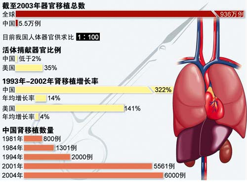

> 转：[CCTV.com-中国叫停“器官移植旅游”](https://news.cctv.com/law/20070721/101000.shtml)
> 转：[中国叫停“器官移植旅游” | 南方周末](https://www.infzm.com/contents/3668)
> 转：[中国叫停“器官移植旅游” | 南方周末](https://www.infzm.com/contents/3683)
> 转：[中国叫停“器官移植旅游” | 南方周末](https://www.infzm.com/contents/9556)

---

# 中国叫停“器官移植旅游”

央视国际 www.cctv.com　　 2007 年 07 月 21 日 13:38 来源：南方周末

南方周末记者 成功 发自天津

#### 卫生部发文严格限制国内医院为外国人实施器官移植手术

图为安徽淮北矿区的一次肝移植手术 谢正义／图

ｅｇｒａｐｈｉｃ３６５／图

3 个月前，哈迪德又一次来到中国。往常，这位来自阿曼的贸易商会奔波穿梭在广州、东莞等地，用集装箱把中国的玩具、工艺品成箱成箱地运回中东，赚取一笔笔丰厚的利润。

但这次不同，甫下飞机，哈迪德就带着 27 岁的儿子直奔天津第一中心医院东方器官移植中心(以下简称东方器官移植中心)。在这个亚洲最大的器官移植中心，哈迪德决定要为儿子“买一个肝”。

7 月 8 日，在东方器官移植中心二楼咖啡厅里，55 岁的哈迪德向南方周末记者谈起了这次中国之旅——“去年，医生诊断出我儿子患有肝硬化，并建议进行肝移植手术。”

由于阿曼缺乏肝的供体和医疗条件，哈迪德把目光转向了国外，“就像你所知道的，阿曼只是一个拥有 230 万人口的阿拉伯小国，加上宗教原因，几乎找不到肝的捐献者。”哈迪德曾想过去欧洲或美国，但他很快发现，“在美国，肝移植平均等待时间为 12 个月，而换肾者需要等上三年半”。

“我的孩子可能等不到移植的那一天，就被夺取生命。”哈迪德最后接受了朋友的建议，到中国是一个不错的选择——“互联网上的广告承诺说，到中国肝移植等待时间为一个月，而且有充足的肝源供体。”

今年 4 月，哈迪德和儿子来到中国。然而，直到 7 月份，肝移植手术仍然遥遥无期。医生告诉哈迪德，“没有供体，你需要等待。”

#### 等待我的肝

哈迪德的遭遇并不是惟一的个案。58 岁的阿里·纳伊米躺在东方器官移植中心的病床上，打着吊针。这位来自沙特的肝癌患者用手指着自己的肝脏位置问：“我的捐赠者在哪儿？”

通过侄子小阿里的翻译，阿里·纳伊米告诉南方周末记者，在向一家中介代理公司支付 8 万美元后，他于今年 3 月份来到东方器官移植中心。“4 个月过去了，我们等来的答复都是没有供体。原来 40 天安排肝移植手术的承诺也兑现不了了。”

“在这家医院，等待肝移植手术的病人有 25 个来自沙特，其他阿拉伯国家的病人大概有 65 个。”在二楼咖啡厅，小阿里每天和其他病人、家属在一起聊天、交流信息，“除了等待，我们什么也干不了。”

由于缺乏供体无法进行肝移植手术，一些病人开始选择回家，“还有两位肝癌病人因病重而身亡。”来自巴基斯坦的贾迈勒说，他非常担心身患肝癌的父亲能否撑到肝移植手术的时候。

因为语言障碍，这些跋山涉水来到中国的外国患者，几乎都没有留意到中国卫生部的一条重要消息。7 月 3 日，卫生部发布《卫生部办公厅关于境外人员申请人体器官移植有关问题的通知》。通知要求人体器官移植应优先满足中国公民需要，“医疗机构及其医务人员不得为以旅游名义到我国的外国公民实施人体器官移植。”同时，对于违反规定的医疗机构及其医务人员，将给予严厉处罚。

“我们去年就开始了这方面的准备工作。”东方器官移植中心常务副主任朱志军接受南方周末记者采访时说，卫生部这次通知的精神，早在 2006 年广州举行的人体器官移植峰会时就提出来了。

峰会声明，中国的人体器官十分短缺，中国每年约有 150 万人等待器官移植，但仅有约 1 万人能够接受移植手术。按照世界卫生组织指导原则和国际惯例，器官移植优先满足本国公民需要，禁止以旅游名义为外国人进行器官移植，仅特殊情况例外。

“这些外国患者都是去年联系注册入院的。”朱志军说，“我们将严格执行卫生部的通知要求，劝说外国病人回国。上个星期，我们刚劝走了十多个中东患者。”。

但仍有一些外国病人坚持要做器官移植手术。有些病人联系本国大使馆，并通过中国外交部来做工作。阿里·纳伊米说，沙特驻华使馆官员曾两次来医院交涉，要求为沙特人完成移植手术，但使馆官员走后，医院仍然没有答复；而另外一些身份显赫的外国病人甚至把求助电话打到了高层领导人的办公室。

“对于这些外国患者如何处理，我们已经打报告到天津市卫生局报批。”朱志军说，“我们在考虑对病情确实严重和与我国传统关系友好国家的病人能否做移植手术，当然这要等待卫生部的最终意见。”

#### 昔日繁荣的“器官移植旅游”

对来自沙特的阿里·纳伊米来说，在中国支付 8 万美元肝移植手术费用并不算昂贵，因为“同样的手术在沙特要 20 万美元”。而让他选择中国的最为关键的因素是，“等待器官的时间比其他国家要短”。

“器官移植手术在国际上存在这样一种趋势，患者会从器官等待长的国家向器官等待时间短的国家流动。”陈忠华说，国际器官移植学会把这种“移动性寻求器官”称为“器官移植旅游”。陈忠华是中华医学会器官移植分会副主任委员、同济医学院器官移植研究所所长。

因为中国器官移植规模的快速发展，且器官供应量大、手术费用相对较低，迅速吸引了韩国、中东一些国家、美国、日本、以色列等地的病人到中国进行“器官移植旅游”。中国第一例肝移植手术是由上海瑞金医院林言箴教授于 1977 年主刀。此后 6 年，中国共做了 57 例肝移植，但效果不好，大部分病人术后死亡。

在卫生部副部长黄洁夫看来，中国第二轮肝移植高潮是由 1993 年一批从国外学成归来的中青年医生创造的。

东方器官移植中心创始人、天津第一中心医院副院长沈中阳便是其中之一。1994 年 5 月，从日本留学回来的沈中阳主持完成该院首例肝脏移植手术。“当时沈教授计划用 3－5 年的时间，完成 5 至 8 例肝移植。”东方器官移植中心常务副主任朱志军回忆说，而后来器官移植发展速度远远超出所有人的期望。

1998 年，沈中阳带着十几个人组建天津第一中心医院移植学部，并从医院“分家”独立出来，当时许多医生还担心自己丢了“铁饭碗”。但肝移植业务却以惊人的速度增长：仅 1999 年就完成肝脏移植 24 例，2000 年达到 78 例，2003 年完成 356 例。在 2004 年，他们共完成肝脏移植 507 例，打破美国匹兹堡大学器官移植中心保持的世界肝移植例数最多的纪录。算上肾移植的 368 例，已更名为东方器官移植中心的移植学部成为亚洲最大的器官移植中心。在 2005 年和 2006 年，肝移植的数量更是超过了 600 例。

显然，业务的突飞猛进，“器官移植旅游”是重要的助推器。“最初是一些港台的病人慕名而来，接着外国人也开始多起来了。”朱志军回忆，从 1998 年开始，一些在广州经商的中东人找到了医院，后来就像滚雪球，越来越多。

到后来，东方器官移植中心的国外患者所占比例甚至已超过国内患者。据《朝鲜日报》报道，2004 年，该院进行的 507 例肝脏移植手术中，韩国人占 37％左右，其他外国人占 16％左右，国外患者比例超过 53％。从 2002 年开始，东方器官移植中心收治韩国患者已超过 500 人。

另据《华尔街日报》报道，每年以色列 30 例心脏移植手术中，有 10 例是在中国进行的；在过去五年间，至少有 200 名以色列人在中国接受了肾脏移植。

随着国外患者的与日俱增，器官移植手术费用也水涨船高。2004 年初，东方器官移植中心的肝脏移植手术费用为 3.2 万美元(约合人民币 25 万元)左右，到 2006 年，已攀升至人民币 40 万元。但对于国内病人，肝移植手术费用仍维持在 20 万元左右。

之所以要实施内外有别的“价格双轨制”，东方器官移植中心常务副主任朱志军解释说，外国人占用了中国人的器官资源，当然要付出更多代价。

急剧膨胀的业务，让东方器官移植中心获得巨额营收。据此前媒体报道，仅肝移植一项，一年即可为中心带来至少 1 亿元的收入。2006 年 9 月，东方器官移植中心新大楼启用，这栋投资 1.3 亿、拥有 500 张病床的移植中心正向人们展示它的实力和雄心。

朱志军并不否认向外国患者提供器官移植的服务，促进了东方器官移植中心的发展和壮大，但他认为当时卫生部并没有对“器官移植旅游”出台禁止性管理规定。

#### 形势“急转直下”

然而，自今年以来，器官移植旅游的形势“急转直下”。

在东方器官移植中心二楼办公室里，朱志军显得有些忧心忡忡。从春节后到现在，近半年过去，这家号称亚洲最大的器官移植中心总共才做了 15 例肝移植手术。而在 2006 年，东方器官移植中心创造出了一年完成 600 多例肝移植手术的纪录。

“主要是没有供体。”朱志军无奈地看着手术数量直线下降。即使已经完成的 15 例移植手术，供体也都是活体移植，也就是说肝源供体来自于亲属。

朱志军认为，目前的困境源于最近关于器官移植一系列法律法规的颁布，而卫生主管部门对人体器官移植的管理也变得更加规范和严格。

从今年 5 月 1 日起，国务院《人体器官移植条例》正式实施。条例规定，将未经许可摘取人体器官的行为视作违法。同时，该规定还禁止以盈利为目的的人体器官买卖，不得摘取未满 18 周岁公民的活体器官。

王伟强患有肝硬化，但他是个幸运儿。在耐心等待两个月后，这位来自新疆的出租车司机终于在 2006 年的最后一天得到一个匹配供体，并顺利完成肝移植手术。在支付 6.5 万元的“供体材料费”后，现在，48 岁的王伟强胸腹里搏动的是一个 31 岁男子的肝。

“手术很成功，排斥反应很小。”王伟强毫不介意供体来源。他是去年在东方器官移植中心接受肝移植的 600 位患者之一。

业内人士透露，我国器官移植的供体来源主要有三种，死刑犯捐献、亲属间活体移植，以及脑死亡和传统死亡之后的自愿无偿捐献者。

从 1993 年以来，由于技术突破和一批新生力量加入，中国的器官移植手术突飞猛进，成为仅次于美国的第二器官移植大国。但是中国内地肝脏移植方面的临床实践和研究成果，始终无法出现在国际顶级医学期刊上。其中一个重要原因就是，论文作者无法说明供体的来源。

“国际器官学会曾经发过一个 3 页的文件，公开拒绝中国内地学者向大会提交有关器官移植的论文和报告。”毕业于剑桥大学的陈忠华对此深有感触。

2005 年 7 月，卫生部副部长黄洁夫在世界肝脏移植大会上首次表示，目前中国多数移植器官来自死刑犯。他指出，摘取死刑犯器官是在征得死刑犯及其家属同意的前提下，并遵循普遍性的伦理学原则进行的。他同时表示，中国政府将鼓励亲体和活体提供器官。黄洁夫的发言引起轰动，也得到了国际器官移植学术界的高度认同。

为了鼓励病人进行活体移植，东方器官移植中心副主任朱志军最近决定对该中心的前 50 例手术实施费用减免，“把原来 15 万－20 万的手术费用降到 10 万，差额部分用科研经费补上。”

“为了让人体器官移植与国际惯例接轨，暂时牺牲手术量也是值得。”朱志军说。

过去的几年中，陈忠华一直在竭力推广脑死亡标准的立法工作，试图能得到同行和法律界的认同。目前，中国执行的死亡标准是心脏死亡，而心脏死亡后几分钟，器官功能就会丧失而不能进行移植。但有关脑死亡问题的动议，最近几年毫无进展。

目前，陈忠华所在的同济医学院器官移植研究所已实施 55 个脑死亡案例。共捐献 222 个器官给 40 多家医院，为 200 多个患者进行了器官移植。

#### 让器官移植更公平高效

2005 年 6 月，被诊为肝癌晚期的电影演员傅彪在天津第一中心医院进行了第二次换肝手术，引起舆论界对器官分配公平性的强烈争议。

作为东方器官移植中心常务副主任，朱志军对招揽器官移植生意的中介很“痛恨”。一些中介仗着有钱，到处找人说情，找机会“插队”。而在东方器官移植中心，病人等待供体的原则是按登记资料“先来后到”的顺序排队。因此，中介的做法让其他病人怨声载道。

朱志军期盼能建立一个器官移植登记网络，就像美国器官共享联合网络 UNOS 那样，能根据病情、等候时间、配型结果等因素来排序分配器官，“不用为器官的来源和分配而苦恼，做个纯粹的医生”。

可现实的情况是，每家医院寻找供体时，都是各自为政，各显神通。“大家比的是谁的公关能力强，谁获得供体业务就多。”一位业内人士说。

为了解决器官分配公平和有效使用器官资源，卫生部计划用 3－5 年的时间建立包括科学注册体系和行政注册体系两个层次的人体器官移植体系，加强对器官移植的集中监管。其中，有关器官移植技术规范和临床指南等科学注册体系已经开始进行；而包括器官来源、捐献和分配信息共享网络在内的行政注册体系也已启动。目前，由香港大学协助建立的包括 26 家肝脏移植中心的肝移植登记中心，已经运营两年多。去年 7 月 1 日，卫生部颁布的《人体器官移植技术临床应用管理暂行规定》正式生效，以进一步规范器官移植管理和供体资源的有效利用。“这是一个准入制度，对施行移植手术的医院和医生进行资格认证。”器官移植专家陈忠华评价说。

卫生部副部长黄洁夫曾严厉批评泥沙俱下的器官移植医疗机构，“全国一共有 600 多家医院、1700 名医生开展器官移植手术，太多了！”相比之下，在美国，能够做肝移植手术的只有约 100 家医院，从事肾移植的不过 200 家；而香港特区能够从事肝、肾和心移植手术的医院仅各一家。卫生部政策法规司副司长汪建荣日前透露，全国开展器官移植技术的 600 多家医院中，将只有 160 多家医院获得资质。

显然，中国正在对迅猛发展的器官移值领域进行严格的规范。在此过程中，本显不足的供体会变得更加紧张。而对于有限的供体资源如何进行更公平的分配，自然是题中之意。所以，此次卫生部严格限制对外国人进行器官移值，实属水道渠成之举。

“由于'器官移植旅游'对中国器官供体来源不明的争议，从区域间问题已被放大为一个国际性问题。”陈忠华说，卫生部发布禁止“器官移植旅游”的通知，正是对国际舆论担心的一种回应。

“对于'器官移植旅游'的外国患者，应该让他们都回家！”陈忠华所服务的医疗机构已拒绝为外国人提供器官移植。他认为，不能因为外国人支付更多的钱，就给他们进行器官移植，“这损害了本地人权益”。

而对朱志军来说，针对外国人的这条禁令，他并不担心对东方器官移植中心的业务会产生影响，“我们不愁没有病人，很多港澳台同胞在排队等着。只要有供体，一个电话，他们立刻就来。”

“现在最重要的问题是供体不足，没有供体怎么进行手术？”朱志军说。

(应受访者要求，报道所涉患者均为化名)

责编：唐亮

#### ■ 背景链接

去年７月到今年７月，在一年时间里，卫生部连续出台人体器官移植的相关规定和条例。

２００６年７月１日，卫生部关于《人体器官移植技术临床应用管理暂行规定》明确提出：人体器官不得买卖；医疗机构临床用于移植的器官必须经捐赠者书面同意；捐赠者有权在器官移植前拒绝捐赠器官。申请办理器官移植相应专业诊疗科目登记的医疗机构原则上应当为三级甲等医院，医疗机构开展人体器官移植技术临床应用，必须向省级卫生行政部门申请办理器官移植相应专业诊疗科目登记；须具备人体器官移植临床技术等管理制度。

２００６年１１月，在广州召开的人体器官移植管理峰会上，与会代表们为规范器官移植混乱问题达成了共识，中国医务工作者承诺不参与任何人体器官买卖及与之相关的活动。新制定的行为守则规定，中国公民将具有接受器官移植的优先权。器官移植之旅将受到完全的禁止，但特殊情况允许例外。

２００７年５月１日，首次出台的《人体器官移植条例》将遵循八大原则，包括自愿、知情同意、公平公正、技术准入、非商业化、自主决定等，移植机构将实行准入制，明确规定人体捐献制度，同时首次确定脑死亡标准。

２００７年７月，卫生部根据世界卫生组织人体器官移植指导原则，参照其他国家和地区通行做法，要求各医院停止为外国人做器官移植手术，在中国公民的移植需求尚得不到满足的情况下，不应将器官移植给外国人。

（姚忆江 徐国允）
