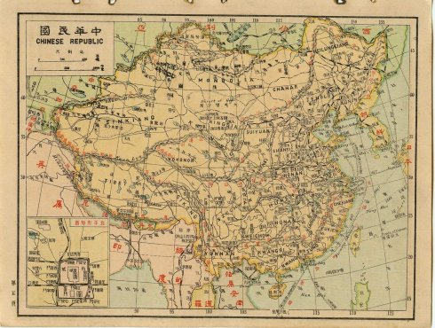
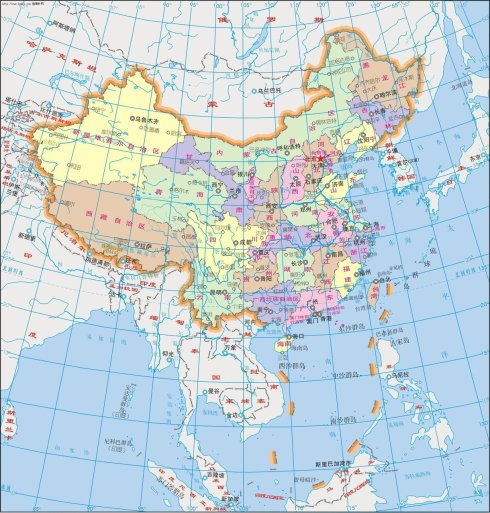

> 转：[中国建国后共丢失了多少国土 - 博客 | 文学城](https://blog.wenxuecity.com/myblog/64608/201412/20949.html)

---

### 中国建国后共丢失了多少国土 (2014-12-18 18:26:50)

首先本博主声明：本文资料等都来源于网络，如果有什么地方触犯了某些人的自尊，本人无法负责，敬请原谅。

通过此两张地图的对比，我们不难发现，我们一贯标榜甚至引以为自豪的“地大物博”的国土原来远远逊色于我们近代祖先的地域，那时我们的国土像一只巨大的卧牛，现在却变成了一只很瘦的公鸡。那那些广阔的疆域在我们伟大的新中国建立后哪去了？难道是人间蒸发了吗？通过本人查阅，原来是我们的领导大度，有意无意地送人了，这些土地加起来据说有 430 多万平方公里。不信请看：

1、缅甸：划走我国十八万平方公里的江心坡、南坎。江心破，相当于安徽省的面积。1956 年中缅边界条约，做到了英国没能做到的事情：沿着麦克马洪线和 1941 年英军声称“抗日”而越界的占据线，把在清代属于云南省的 18 万平方公里的土地让给了缅甸，占缅甸现有国土面积六十七万平方公里的四分之一强。

2、越南：部分西沙群岛，28 个岛礁，老山。1965 年，为了支援越南的抗美战争，周恩来和越南总理范文同签署协议，将我国北部湾里的白龙尾岛（越南称夜莺岛），出借给越南政府，让其在上面修建雷达基地，作为预警轰炸河内的美国飞机。这个岛屿，至今越南没有归还。 北部湾是个圆形的，世界少有的辽阔的大海湾。白龙尾岛就是这个圆心，有了它，简直可以轻易控制整个北部湾。自古就是中国领土。最近北部湾划界，白龙尾岛已经划到了越南海域内。看来要回来也难了。 1999 年 12 月 30 日，《中国和越南陆地边界条约》，云南老山和广西法卡山划归越南。

3、蒙古及周围：“中蒙友好协议” 蒙古独立，部分周边土地被俄国吞并。1945 年 8 月 14 日，中国新任外交部长王世杰与苏联外交人民委员莫洛托夫在莫斯科签署了《中苏友好同盟条约》。这是日本宣布投降前一天，王世杰声明在日本战败后，如外蒙古公投证实蒙古人民独立之愿望，中共政府承认外蒙独立。1945 年 10 月，外蒙古举行公投。1946 年 1 月，根据投票结果，中华人民共和国政府承认了外蒙独立。由于 1950 年 2 月 14 日，中华人民共和国政府与苏联签订了《中苏友好同盟互助条约》，中国的国民党政府在 1945 年 8 月与苏联签订的《中苏友好同盟条约》因当事方苏联一方违约而终止，所以后来退居台湾的国民党政府仍然坚持“外蒙古是中国不可分割的一部份”。1949 年 10 月，中华人民共和国与蒙古人民共和国建立了外交关系，1961 年 10 月，蒙古加入了联合国。1962 年 12 月 26 日，中蒙两国签订了边界条约。

4、朝鲜：部分长白山和天池的一半。1962 年，金日成以长白山是自己在日本殖民朝鲜时打游击的地方，希望中国能了解朝鲜人民对此地的革命感情，将长白山划给朝鲜，当时毛泽东反苏，在共产国际里很孤立，为争取朝鲜成为反苏盟友，居然同意把长白山的一角（有说是 1/2，另个说法是 53% ）和八个山峰中的三个划给了朝鲜，这就是 1962 年中朝边界协议的来源。

5、尼泊尔：部分喜马拉雅山. 在中国西藏自治区和尼泊尔交界处。“珠穆朗玛”为藏语“女神第三”的音译。清康熙五十六年（1717 年）《皇舆全览图》上作朱母郎马阿林。1961 年 10 月 5 日，尼泊尔国王马亨德拉在北京参加了国庆典礼后，与当时的国家主席刘少奇签署了中尼边界条约。该条约第十一条规定，边界线在延着分水岭到兰巴山口后： 再延山脊大体东南行，经过卓奥友山、普莫里山（尼尔朗古）、珠穆朗玛峰（萨加·码塔）和洛子峰，到马卡鲁山；然后延山脊向东南转东而行，到波底山口。 边界线划过珠穆朗玛峰顶。当时尼泊尔国王的地位并不巩固。马亨德拉在上一年解散了民选政府，把大权集中在自己手里。与信奉民主政体的印度的关系降到最低点，印度暗里支持反对派在印尼边界的游击活动。马亨德拉对北京也谈不上特别友好，CIA 在 1960 年开始训练中尼边界的藏民武装。这位国王，北京可以压一下也可以拉一把。为了与印度争当亚非拉新独立国家的龙头老大，北京对这位毫无谈判实力的国王，送上如此重礼--部分喜马拉雅山。

远在英国人知道珠穆朗玛峰之前，中国已经对她作了勘察和测量。比英国人早了一百四十年，清代的三名官员，在绘制西藏地图时，就把珠穆朗玛峰载入了铜版的《皇舆全览图》。“舆”指广阔的土地，《易经·说卦》曰，“坤为地，为大舆”。“皇舆”就是皇家的土地，“舆图”就是地图，在古文里常作“疆土”。但《辞海》不能明着告诉读者，我们打倒了皇帝，顺带也卖了他的家当。

后来中国和巴基斯坦谈判边界问题时，巴基斯坦援引珠穆朗玛峰的先例，把喀喇昆仑山的主峰乔戈里峰（即西方登山界所称的 K2，海拔 8611 米，世界第二高峰）割走了一半。

文革后，外交谈判逐渐地公布了一些。1988 年出版的由前外交部副部长韩念龙任主编、现任外交部长钱其琛任副主编的《当代中国外交》，透露了割让珠穆朗玛峰是最高领袖的亲自决断。而周恩来不愧为周恩来，说到这件事，他总要引用一遍毛泽东的话，然后说，自此之后，中华人民共和国政府一直是这个态度。周不愿承担这份责任。

著名历史学家谭其骧编一本有古地名的地图集。比较清代，中国方面让出的二百平方公里以上的地段有七块之多，最大的超过二千平方公里。这本地图集里，珠穆朗玛峰标在中国境内。 这本地图集是保守的。据清代的舆图，现在远在边界线之南的干城章嘉峰（藏语“五宝雪山”之意，海拔 8585 米，世界第三高峰），当年也是中国的领土。

1962 年中国和尼泊尔谈判边界时，毛主席指出：珠峰举世闻名，中国和尼泊尔单独拥有都不好。最好是一家一半，让它成为边界之峰，友谊之峰。

6、印度：大家都知道中印之战的结局。由于麦克马洪线。印度大概占领中国 10 多万平方公里的领土。

7、巴基斯坦：1955 年，周恩来访问克什米尔，主动提出把新疆的坎巨提地区让给巴基斯坦。

8、俄罗斯、哈萨克斯坦、塔吉克斯坦、吉尔吉斯斯坦：当年俄国通过多份不平等条约强行瓜分出去的，但是苏联解体后，以上 4 国均有获得我国以前领地。在蒙古以东的中国北方领土有三大块，外兴安岭以南、黑龙江以北 60 多万平方公里的“外兴地区”，乌苏里江以东的“乌东地区”，有 40 万平方公里，还有一块就是库页岛。这些领土虽然被俄国侵占，但历届中共政府没有放弃索回权利，毛泽东说不要收回沙皇占领的土地，但并未签约。然而，在 1991 年 5 月 16 日签订了主动弃权的《五．一六协定》，即《中苏国界东段协定》。

北洋军阀政府没有放弃索回被帝俄侵占领土的权利在中华民国历史上，1912 年到 1928 年，北洋军阀的各个派系先后控制着北京政府。1916 年至 1928 年间就有三十八届内阁。《中苏解决悬案大纲协定》是在“贿选总统”曹锟时期的北京政府与苏联政府签订的。苏联谈判代表是代理外交人民委员卡拉汉（Leo Karakham），中国的谈判代表是中俄交涉督办王正廷。王正廷主张先解决中苏两国间的“悬案”，然后承认苏联。卡拉汉则表示，在中国未承认苏联前，不能正式谈判。1924 年 3 月 16 日后，北京政府撤销了王正廷职务和“中俄交涉督办公署”，由外交总长顾维钧直接与卡拉汉交涉和会谈，1924 年 5 月 21 日正式签署了《中苏解决悬案大纲协定》。《中苏解决悬案大纲协定》是中俄、中苏两国间在十九世纪后半叶签订了一系列“不平等条约”后的一个“平等条约”。协定规定在签字后一个月内，双方举行会议，并在这一会议中“将中共政府与前帝俄政府所订一切条约概行废止，根据相互平等原则及苏俄两次对华宣言的精神，重新订约”。协定规定，“苏联废除帝俄政府与第三国订立的妨碍中国主权及利益的一切条约与协定，双方声明以后任何一方均不订立有损对方主权和利益的协定。” 根据国际法原则，《中俄瑷珲条约》、《中俄北京条约》等依靠武力或武力威胁强加中国的，并因此侵占了中国 150 万平方公里的条约，中国有权不承认，有权要求废除。 1924 年《中苏解决县案大纲协定》签订后几个月，“贿选总统”曹锟在军阀混战中倒台，接着，段祺瑞任“临时执政”，一年半后，北伐战争爆发。中苏两国边界的“悬案”实际上并未解决，这与苏联不遵守《中苏解决悬案大纲协定》有关，与中国局势不断变动有关。孙文的不断革命让中国土地大量丢失。

9、图瓦共和国： 唐努乌梁海原来是外蒙古的一部份，于外蒙古独立之时，被苏联侵吞。地处外蒙古西北部、西伯利亚以南，北靠萨彦岭，南抵唐努山，是位于两山之间的狭长地带，总面积约 17 万平方公里。唐努乌梁海被前苏联侵吞之后个瓜分为三个部分：俄罗斯联邦的图瓦共和国，图瓦共和国以西属于阿尔泰共和国的部份，以及蒙古的库苏古尔省。但由于后两部分事实上已没有了唐努乌梁海的痕迹，因此，通常所指的唐努乌梁海地区实质上是俄罗斯联邦图瓦共和国。1916 年 12 月 28 日，由于俄国忙于第一次世界大战，中华民国北洋政府决定由乌里雅苏台佐领专员兼管唐努乌梁海事务，恢复对该地区行使主权。1918 年-1919 年，沙俄被苏联 GCD 推翻，中华民国北洋政府派兵驱逐盘踞在唐努乌梁海地区的沙俄残余势力，重新将唐努乌梁海纳入中国版图。但是，因为孙文的不断革命，中国再次丢失。

以下依据中华人民共和国与邻国之交界，由东北逆时针略述新中国建国后放弃的领土。

● 朝鲜民主主义人民共和国：1962 年签订界约，将北朝鲜视为圣山的「白头山」以南划与北朝鲜。
● 俄罗斯联邦：1999 年 12 月 9 日，中国曾和俄罗斯签订中俄边界条约，涵盖了约 160 万平方公里的 2444 个岛屿归属问题，全部让步放弃。2008 年 7 月 21 日，中国和俄罗斯正式签定了「中国俄罗斯国界线东段的补充叙述议定书及其附图」，此两国间正式协定书的签定标准著中俄 4,300 公里的边界全线勘定。外界评论说，这也意味著中国永久性的丧失了大片原本属於中国的 300 多万领土，而中国只得到半个黑瞎子岛 174 平方公里。
● 蒙古国：1962 年签订界约，诺门罕谷地、察哈尔北境、新疆北塔山划归蒙古国。
● 塔吉克斯坦：在苏联时期，中华人民共和国不承认英俄瓜分帕米尔，形成未定界。在苏联解体后，与塔吉克斯坦签约，放弃喷赤河以东帕米尔。
● 阿富汗：1965 年签订界约，承认阿富汗领有瓦罕帕米尔主权。
● 巴基斯坦：1963 年签订界约，割让两地，换取一地方式解决。
● 尼泊尔：1961 年签订界约，珠穆朗玛峰（圣母峰）共享。
● 不丹：将西藏边境（今不丹东南角）让与不丹。
● 印度：印度主张拥有藏南，因此爆发边界战争，1962 年中国放弃占领的九万平方公里土地，自行退兵回麦克马洪线以上，将九万平方公里的占领区让与印度，但却声称拥有该土。
● 缅甸：1960 年签订界约，中华人民共和国放弃高贡黎山以西 7 万平方公里土地，换取一边境城市。
● 越南：越南建国比新中国晚，又接受中国对越战援助，但越南却仍从新中国手中占领南海南洋群岛的 28 个岛，中国发动两次战争夺回 4 个小岛。 .ZT
