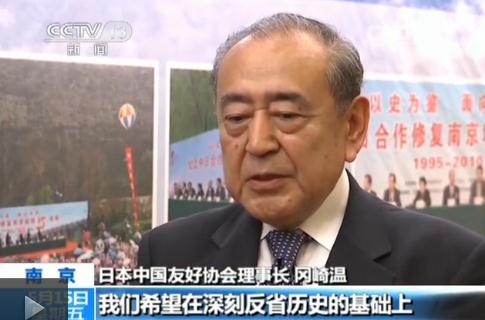
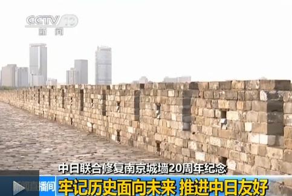

> 转：[中日联合修复南京城墙 20 周年：牢记历史面向未来\_新闻\_央视网(cctv.com)](https://m.news.cntv.cn/2015/05/15/ARTI1431681255137945.shtml)

---

## 中日联合修复南京城墙 20 周年：牢记历史面向未来

央视新闻 2015 年 05 月 15 日 17:35

原标题：

为纪念世界反法西斯战争胜利七十周年，中日联合修复南京城墙 20 周年纪念活动，今天（15 号）在南京举行。

近 400 名中日友好人士参加这次纪念活动，其中，日本代表团包括日中友好协会代表以及日本大学生共 200 多人。二十年前，日本日中友好协会发起中日合作修复在侵华战争中受损的南京城墙，以此表达日本人民对战争的歉意。

#### 日本中国友好协会理事长冈崎温：

特别是现在日中关系面临一些困难，在二战结束七十周年这样一个特殊年份里，我们希望在深刻反省历史的基础上，面向未来，推进日中友好。

20 年前的 5 月 24 日，中日联合修复南京城墙活动正式启动，三年时间修复城墙约三公里。之后五周年、十周年、十五周年，都分别举行图片展等纪念活动，提醒人们不要忘记历史，也不要忘记两国人民的那段友谊。

#### 名古屋大学三年级学生浅井真奈：

我们现在所希望的是，不能回避，要正视这段历史，通过年轻人之间的这种交流活动，一起超越历史，向前看。

#### 佐贺大学两年级学生范东洋彦：

除了了解经济方面的信息之外，我也想把自己来中国的所见所闻，特别是中国人是怎样生活的，这些好的真实的方面，带回日本。

#### 新闻链接：修复历史古迹 抚平战争创伤

南京古城墙始建于明朝，距今已经 600 多年。它最后一次发挥军事防御功能，就是在日本侵华战争期间，并在战火中遭受了历史上最严重的一次损害。中日联合修复南京城墙活动，背后还有哪些故事？

南京城墙在抗战中受损最严重的，就在中华门。1937 年侵华日军就是在这里攻打南京城，数日的激战，在猛烈的炮火攻击下，城墙受损严重。虽然很多年过去也历经多次修缮，当年的炮火和子弹留下的痕迹还依然能够看到。

弹孔犹在，城墙残存，中华门上的城楼，在战火中化为灰砾。中山门、光华门也受到不同程度损害。上世纪八十年代开始，南京城墙开始大规模修缮，而其中有一段，相当特别。

#### 南京市人民对外友好协会原副会长孙文学：当时日中协会平山郁夫会长就提出来，中日合作修复南京城墙，通过我们这个（联合）修复，能够弥补古迹上面留下来的窟窿。还有一个，就是通过修复城墙，能够医好南京人民心灵上的创伤。

1995 年，时任日中友好协会会长，同时也是国际知名画家的平山郁夫，利用自己的个人影响力，积极推动日本各界参与中国南京城墙修复。

三年修复时间里，日本各地共有 2 万多名友好人士来到南京参与活动，募集的捐款超过 7 千多万日元，中日联合修复南京古城墙，成为新时期中日和平友好的象征。

前日中友好协会会长平山郁夫的夫人平山美知子今年已经 89 岁高龄，坚持代表已故的丈夫平山郁夫，亲自参加 20 周年纪念活动。她说，现在两国政府间存在一些问题，但是越是这个时候，民间的交流越要加强。

编辑：孙毛宁
