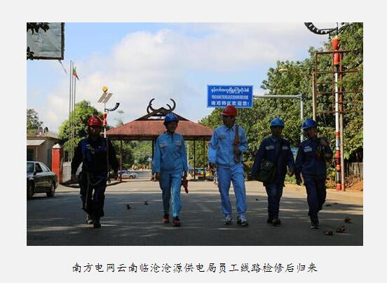

> 转：[农村电气化信息网 - 南方电网：点亮缅北万家灯火(图文)](https://ncdqh.com.cn/news/201807/192641.html)
> 转：[南方电网：点亮缅北万家灯火 - 电力范文 - 售电市场政策-售电平台系统-售电产业服务公司-电力交易中心-能源节能管理服务-大云网](http://www.sgcio.com/dlfw/89288.html)

---

### 南方电网：点亮缅北万家灯火(图文)

作者：田钿 孙应钦 王冰迪 2018-07-26

万物润泽，山水相连。站在地球仪面前，从中国地图上看，临沧是中国的边疆，从世界地图上看，临沧是亚洲的中央。

自“一带一路”倡议被提出以来，成效惠及世界，参与各国分享中国发展机遇，实现共同繁荣。

南方电网以电力为基础的能量链接，正在谱写中国与周边国家互利互惠、改善民生的新故事。南方电网公司抓住“一带一路”倡议机遇，充分发挥公司的区位及地缘优势，实现了与越南、老挝、缅甸电网互联，带动国内电力技术、装备、施工“走出去”，为当地社会经济发展起到了积极促进作用。

南方电网云南临沧供电局利用自己的区位优势，早在 26 年前，就“云电外送”到缅甸，为两地的发展书写着友谊篇章。

#### 一根银线牵两国师徒情谊连两地

碧绿的斜坡上，种满了一棵棵青翠欲滴的澳洲坚果。透过澳洲坚果青枝绿叶的空隙，就可看到半山腰上，一根根银线横跨天际，从芒卡口岸延伸出去，连接到缅甸南邓特区。

公勐大山巍巍，南定河奔腾。在这里，一山连两国，一水流两地。

自从两条 10 千伏的高压电缆从芒卡变电站出发，穿行雄伟壮观的公勐大山，走出“云电外送”之门，强劲的电流就慷慨而恢弘地灌溉缅甸南邓特区，给当地百姓带去了从物质到精神生活的瑰丽嬗变。中缅两国的友谊在这里得到进一步发展。

南方电网云南临沧沧源供电局芒卡供电所配电班班长尹东和他的两名缅甸弟子将两国的友谊凝聚在浓浓的师徒情里。

2014 年，缅甸南邓容林电力公司组织 8 人到南方电网云南临沧沧源供电局学习线路维修与设备校准，其中两人跟随当时还在该局安检部工作的尹东学习。

虽然国籍不同，但三人对电力工作的价值认可一致。尹东结合自己的知识与外出作业经验，认真教导两人作业时如何保证人身安全，抢修过程中怎样调整设备的运行方式。

两人学成回国后，依靠从尹东这里学到的专业知识，顺利从变电站调到当地县供电局的工程技术部。他们对尹东的不吝教导十分感激，尊称他为老师。此后，三人依然保持着联系。

2015 年，尹东调到南方电网云南临沧沧源供电局芒卡供电所工作。他说：“当时只有两条 10 千伏的高压电缆送到南邓特区，当地有 5000 多人用中国电。今年升级了，一条 10 千伏的高压电缆，一条 35 千伏的高压电缆送电到南邓特区，有 8000 多人用中国电。”

尹东每月都要带队巡视从南方电网云南临沧沧源供电局芒卡变电站到缅甸南邓特区的两条专供线路。他的巡视任务分为几方面：线路通道、钢塔基础、钢塔间距、瓷瓶上导线是否脱落，拉线不能松动等。专线全长 25 公里，其中，中国境内有 7 公里，缅甸境内有 18 公里。

每年南邓容林电力公司都要邀约尹东到缅甸带领他们的供电人员一同巡视。2017 年 5 月，他在缅甸参与共同巡视时，发现一台变压器绕组烧了，造成一整条 10 千伏的高压电缆不具备运行条件，影响两千多人的生活用电。最后他打电话联系厂家，更换了变压器，才解决了这一问题。这一次，他在缅甸工作了三天。

每当尹东到缅甸参与共同巡视时，他的两个弟子都要赶来与他相见，这次也不例外。

尹东说：“我选择这个职业，就要尽自己的力量去做好巡视工作，虽然一个人的能力有限，但对维护两国的友谊尽一点力量，是值得的。”

南方电网云南临沧沧源供电局支部书记、副局长贺廷磊介绍说，沧源与缅甸山水相连。沧源县在“云电送缅”中具有得天独厚的区位优势，全县共有 6 条专线送电到缅甸，送到南邓特区及当地的一些村寨，当地有 16000 人用中国电，每天的供电负荷为 13000 千瓦时。这对促进中缅两国的经济建设，融入国家建设具有重要意义。

#### 缅民称赞中国电电力搭建友谊桥

42 岁的缅甸居民李兰芳称，他家小时候点煤油灯，磨谷子是最麻烦的事，因为没有电，家里每次都是利用水力来舂米碾谷子，100 斤谷子要碾两天，大米虽然去壳了，仍有黄皮附在上面，吃起来十分粗糙。

直到他二十多岁时，才用上中国电。他说，有的人认为有电视看，有冰箱用，是件快乐的事。但对他来讲，从打米机里出来白生生的大米，吃起来香软可口，才是让他最开心的事。

许多缅甸民众与李兰芳一样，对中国电十分满意。他们认为中国电稳定，不会忽强忽弱，也不会随意停电，无论是看电视，还是洗衣服，用起来都十分方便。

“临沧向缅北供电有 26 年历史，双方结下了 26 年情谊。”南方电网云南临沧供电局副局长李少华说，临沧市沧源、镇康与耿马三个县供向缅北的电力有 20 条线路，供电量逐年增长，近五年来，年均增长率为 20.7%。去年对缅供电量首次突破１亿千瓦时。今年１-５月对缅供电达到７千多万千瓦时，预计全年对缅供电量将超过 1.2 亿千瓦时。

李少华认为，对缅供电是南方电网云南临沧供电局主动服务和融入国家一带一路建设发展的重要举措，通过企业先行，设施连通，用中国电点亮了缅北人民的万家灯火，从而构建了中缅人民友谊的桥梁。

更多精彩信息请关注中国农村电气化网！

来源：南方电网
标签：南方电网,缅北,万家灯火
