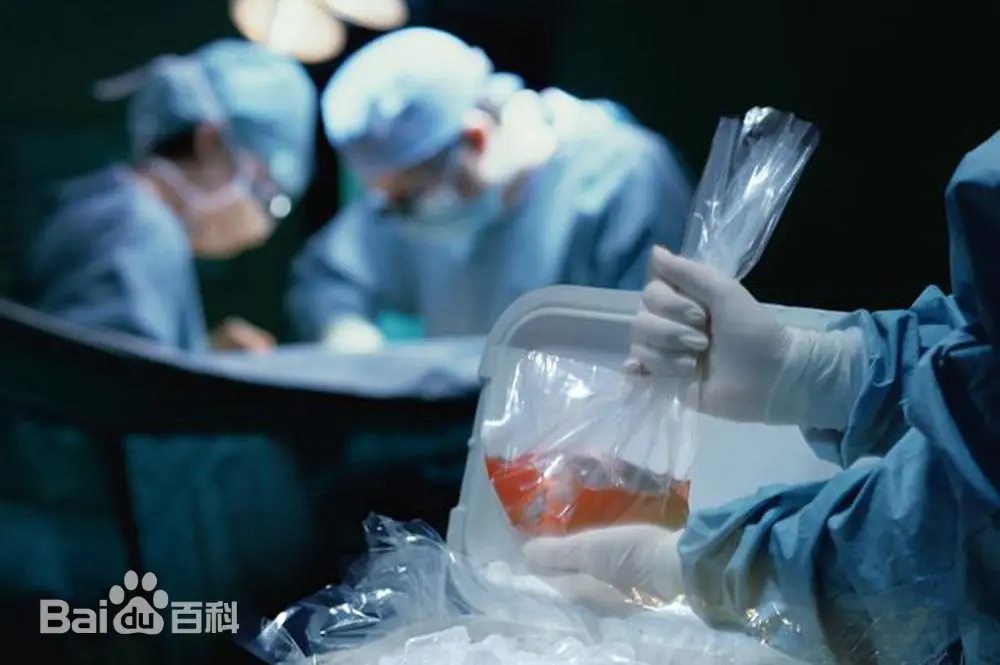
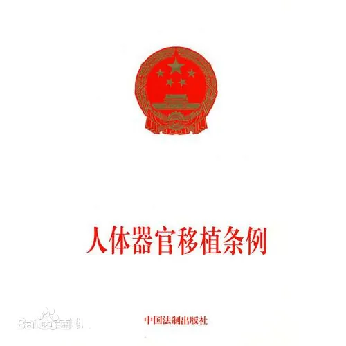
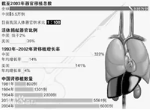
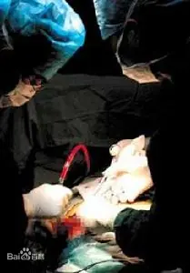

> 转：[器官移植旅游\_百度百科](https://baike.baidu.com/item/器官移植旅游/2287024)

---

# 器官移植旅游

#### 医学术语

所谓“器官移植旅游”，是指等待器官时间较长的国家公民，前往器官等待时间相对较短、手术费用相对较低的国家接受器官移植。这种与支付能力较弱的国家病人争夺器官资源的行为，违背了世界卫生组织所倡导的伦理准则和国际惯例。

中文名器官移植旅游
外文名 Organ transplant tourism
相关法规《人体器官移植条例》

目录
1 中国叫停
2 中国昔日繁荣
3 在华移植
4 明确反对
5 媒体评论
6 专家建议
▪ 器官调配机制
▪ 专家建议
7 反思

## 中国叫停

2006 年 7 月 1 日，卫生部关于《人体器官移植技术临床应用管理暂行规定》明确提出：人体器官不得买卖；医疗机构临床用于移植的器官必须经捐赠者书面同意；捐赠者有权在器官移植前拒绝捐赠器官。申请办理器官移植相应专业诊疗科目登记的医疗机构原则上应当为三级甲等医院，医疗机构开展人体器官移植技术临床应用，必须向省级卫生行政部门申请办理器官移植相应专业诊疗科目登记；须具备人体器官移植临床技术等管理制度。 2006 年 11 月，在广州召开的人体器官移植管理峰会上，与会代表们为规范器官移植混乱问题达成了共识，中国医务工作者承诺不参与任何人体器官买卖及与之相关的活动。新制定的行为守则规定，中国公民将具有接受器官移植的优先权。器官移植之旅将受到完全的禁止，但特殊情况允许例外。

2007 年 5 月 1 日，首次出台的《人体器官移植条例》将遵循八大原则，包括自愿、知情同意、公平公正、技术准入、非商业化、自主决定等，移植机构将实行准入制，明确规定人体捐献制度，同时首次确定脑死亡标准。

2007 年 7 月，卫生部根据世界卫生组织人体器官移植指导原则，参照其他国家和地区通行做法，要求各医院停止为外国人做器官移植手术，在中国公民的移植需求尚得不到满足的情况下，不应将器官移植给外国人。

## 中国昔日繁荣

对来自沙特的阿里·纳伊米来说，在中国支付 8 万美元肝移植手术费用并不算昂贵，因为“同样的手术在沙特要 20 万美元”。而让他选择中国的最为关键的因素是，“等待器官的时间比其他国家要短”。

“器官移植手术在国际上存在这样一种趋势，患者会从器官等待长的国家向器官等待时间短的国家流动。”陈忠华说，国际器官移植学会把这种“移动性寻求器官”称为“器官移植旅游”。陈忠华是中华医学会器官移植分会副主任委员、同济医学院器官移植研究所所长。

因为中国器官移植规模的快速发展，且器官供应量大、手术费用相对较低，迅速吸引了韩国、中东一些国家、美国、日本、以色列等地的病人到中国进行“器官移植旅游”。

中国第一例肝移植手术是由上海瑞金医院林言箴教授于 1977 年主刀。此后 6 年，中国共做了 57 例肝移植，但效果不好，大部分病人术后死亡。

在卫生部副部长黄洁夫看来，中国第二轮肝移植高潮是由 1993 年一批从国外学成归来的中青年医生创造的。

东方器官移植中心创始人、天津第一中心医院副院长沈中阳便是其中之一。1994 年 5 月，从日本留学回来的沈中阳主持完成该院首例肝脏移植手术。“当时沈教授计划用 3－5 年的时间，完成 5 至 8 例肝移植。”东方器官移植中心常务副主任朱志军回忆说，而后来器官移植发展速度远远超出所有人的期望。 1998 年，沈中阳带着十几个人组建天津第一中心医院移植学部，并从医院“分家”独立出来，当时许多医生还担心自己丢了“铁饭碗”。但肝移植业务却以惊人的速度增长：仅 1999 年就完成肝脏移植 24 例，2000 年达到 78 例，2003 年完成 356 例。在 2004 年，他们共完成肝脏移植 507 例，打破美国匹兹堡大学器官移植中心保持的世界肝移植例数最多的纪录。算上肾移植的 368 例，已更名为东方器官移植中心的移植学部成为亚洲最大的器官移植中心。在 2005 年和 2006 年，肝移植的数量更是超过了 600 例。

显然，业务的突飞猛进，“器官移植旅游”是重要的助推器。“最初是一些港台的病人慕名而来，接着外国人也开始多起来了。”朱志军回忆，从 1998 年开始，一些在广州经商的中东人找到了医院，后来就像滚雪球，越来越多。

到后来，东方器官移植中心的国外患者所占比例甚至已超过国内患者。据《朝鲜日报》报道，2004 年，该院进行的 507 例肝脏移植手术中，韩国人占 37%左右，其他外国人占 16%左右，国外患者比例超过 53%。从 2002 年开始，东方器官移植中心收治韩国患者已超过 500 人。

另据《华尔街日报》报道，每年以色列 30 例心脏移植手术中，有 10 例是在中国进行的；在过去五年间，至少有 200 名以色列人在中国接受了肾脏移植。

随着国外患者的与日俱增，器官移植手术费用也水涨船高。2004 年初，东方器官移植中心的肝脏移植手术费用为 3．2 万美元（约合人民币 25 万元）左右，到 2006 年，已攀升至人民币 40 万元。但对于国内病人，肝移植手术费用仍维持在 20 万元左右。

之所以要实施内外有别的“价格双轨制”，东方器官移植中心常务副主任朱志军解释说，外国人占用了中国人的器官资源，当然要付出更多代价。

急剧膨胀的业务，让东方器官移植中心获得巨额营收。据此前媒体报道，仅肝移植一项，一年即可为中心带来至少 1 亿元的收入。2006 年 9 月，东方器官移植中心新大楼启用，这栋投资 1．3 亿、拥有 500 张病床的移植中心正向人们展示它的实力和雄心。 [1]

## 在华移植

从日本负责脏器移植的一家非营利团体的干部处获悉，中国从 2007 年原则上禁止向外国人移植脏器以来，至少有 17 名日本人在中国接受了肾脏、肝脏移植手术。

各国关于脏器移植的不同状况和经济差距让跨国脏器移植成为一个国际问题，违法的“黑市移植”问题也越发突出。

据该干部透露，患者在 50 到 65 岁间。多数为肾脏移植，一部分是肝脏移植。患者在中国大约停留 20 天，在广州市的医院接受移植手术。移植共需要大约 800 万日元（约合 59.5 万元人民币），包括向医院和医生支付的手术费、旅费费用和在中国期间的开销。

为了不让事情暴露，还有日本患者应中国医院方面的要求用中国人的名字住院。提供脏器的人可能多是被判定脑组织死亡的死刑犯。由于有来自国际上的指责，北京奥运会后就没有日本人在中国接受脏器移植手术。

该干部表示“没有向提供脏器的人付钱，所以不是脏器买卖。也没有收取中介费用”。 [2]

## 明确反对

针对最近一些媒体关于外国人在中国医院接受人体器官移植的报道，卫生部新闻发言人毛群安在例行新闻发布会上表示，卫生部已责成相关部门对此开展调查，情况一经查实，将对违规为外国人提供脏器移植手术的医疗机构进行严肃处理。毛群安说，按照国际惯例，中国反对通过旅游的方式到其他国家做人体器官移植。中国的器官移植主要用于急需的国内患者身上。

毛群安表示，如果允许“旅游移植”的现象存在的话，可能会扰乱各个国家开展器官移植业务的正常秩序。解决这一问题还需要加强国际间的合作和协调，各个国家都应该遵守国际卫生组织所确立的原则，防止本国的公民出境进行器官移植手术。只有国家间进行合作、协调，这样才能够杜绝“移植旅游”。

## 媒体评论

#### 日本人广州移植肾肝 中国舆论：严罚医院

自中国前 2006 年原则上禁止向外国人移植器官以来，至少有 17 名日本人在广州接受了肾脏、肝脏移植手术。日本共同社的这则报道在上周末被人民网转载后，立即在广州，乃至整个中国引起轩然大波，大多数网民认为，违规给日本人做器官移植手术的医生和医院必须受到严罚。

而由于所牵涉的都是日本人，一些舆论甚至把违规的医生和医院与抗战时期的伪军和汉奸相提并论，网上评论员张西流就说：“个别医疗机构眼睁睁地看着自己的同胞因缺少人体器官来源，在病床上痛苦地挣扎而见死不救，却将如生命般宝贵的人体器官来源，提供给日本人以获取暴利，这种贪图私利、出卖良知、损害国格的可耻行径，与抗战时期那些卖国求荣的伪军、汉奸又有何区别？”

#### 卫生部责成相关部门调查

以上报道已引起了中国政府的高度重视，卫生部新闻发言人毛群安重申，中国一直遵循世界卫生组织在人体器官移植方面所确定的原则，反对通过旅游的方式到别的国家进行器官移植。针对以上报道，卫生部已经责成相关部门开展调查，违规开展器官移植手术的情况，一经查实将依据有关法律法规严肃处理。

各国关于器官移植的不同限制和“价码”让违法的“移植旅游”问题日渐突出。据本报了解，广州在器官移植领域的医疗技术水平由于多年来的累计经验，属全国的佼佼者，在中国未原则上禁止向外国人移植器官前，很多外国人都到广州进行这类手术，除了日本人外，主要“客户群”也有来自东南亚的患者。

## 专家建议

### 器官调配机制

人体器官短缺是世界性的难题，依照国际上通行的惯例，各个国家一般优先考虑本国的患者，对于外籍人员到境内接受器官移植手术都有一些限制条件。比如美国，如果以移植器官为目的赴美，通常会被拒之门外。

“卫生部的通知要求和国际惯例是一致的，目的是为了更好地首先满足国人的需求。”广东省卫生厅副厅长廖新波接受南方周末记者采访时说，“器官移植涉及人权、伦理和技术方面的问题，卫生部出台这样的条例和通知是基于三个方面的目的：一是希望能与国际接轨，二是为了规范管理，三是为了优先满足国内的需求。”

专家称，一些国家就明确规定，对外国人移植器官不超过百分之五。“器官是中国人捐献的，首先就应该优先照顾国人，这是个医疗公平问题。卫生部对于器官移植不是绝对的禁止，而是要经过审批。”中华器官移植学会一位主任委员解释。

对于中国绝大多数医院来说，国外器官移植的市场，显然是一块利益巨大的蛋糕。“起步较晚、治疗不规范、发展不平衡、一哄而起。”有专家这样概括中国器官移植的现状。供体资源的严重缺乏，引发了器官买卖的暗箱操作，有人为高额利润铤而走险，大医院附近器官买卖广告随处可见。

现状是，一些医院没有申请准入或没通过评估也在做移植手术；有的医院的评估期限已过，没有重新申请仍在继续开展此类手术；有的获得肾移植手术评估的医院同时在做肝移植手术。

“个别医院在网上做广告，被国际卫生组织下载下来，作为批评中国的证据。”陈忠华教授说。

开展器官移植还能给医院带来社会效益和学术影响，特别是三甲医院的评比之中，“能够开展 5 例以上器官移植手术”被当成了一项硬性评估指标。中国卫生部副部长黄洁夫在一次会议上承认，“中国开展器官移植的医疗机构鱼龙混杂，良莠不齐，出现无序竞争的局面，这些问题严重影响国家的形象和声誉，也危害病人健康，必须尽早改善。”

中国的总体疗效落后于世界先进水平，器官移植管理混乱、不规范问题在国际上引起了非议。不具备资质就不能做器官的移植。今年 5 月 1 日实施的《人体器官移植条例》中，明确规定了必须是三级甲等医院才有这个资格开展器官移植。

“这些年来国内器官移植发展得很快了。”中山大学附属第一医院器官移植中心何晓顺主任说，从 2006 年统计的数字来看，全国肝移植大约 3000 例，肾移植大约是 5000 例，全国的移植规模大概就是这个数字，从数量、规模上来说，中国已成为第二大器官移植大国。

不可否认，中国的器官移植已经接近或达到国际先进水平。但中国器官移植领域多少还有些“缺规少矩”，中国没有建立器官移植病人的管理资料库，而只是在小范围内做调配。

国外有比较完善和透明的器官分配体系。欧美国家有一个专门的、政府指定的机构或者委员会，负责人体器官捐献登记与调配，在一定程度上保证了器官分配的公平、公正、公开。

中国目前还没有类似机构和网络体系，器官分配公平性也存在问题。一些具有一定经济基础的患者可以得到器官移植治疗，而且在一次器官移植失败后，还可以继续获得二次器官移植，而不具备支付能力却又急需器官移植的患者，往往一次器官移植的机会也不能得到。

### 专家建议

专家建议，中国应借鉴国外经验，每一个省、直辖市、自治区或大城市都应建立一个统一的器官移植中心，按照申请先后、病情轻重、距离远近以及“国内优先”等原则，保证器官受植者机会平等。

《人体器官移植条例》借鉴国外的实践经验，确定了人体器官移植预约者名单制度和按照公平、公正、公开原则确定申请人体器官移植手术患者的排序制度。

## 反思

中国政府在 2007 年强化了脏器移植管理，优先考虑国内患者的需要，禁止向以旅行为由来华的外国人移植脏器。这也是世界卫生组织关于器官移植的普通原则。但从现实来看，“器官移值旅游”的现象并非得到根本性的解决。

这并不令人感到意外。由于各国经济状况存在着巨大差异，器官移植手术的暴利，以及稀缺的器官资源，“器官移植旅游”一直以来就是一个世界性的难题。令人感到意外乃至无法释怀的是，“17 名日本人在中国接受肾脏、肝脏移植手术”的消息来自日本共同社，这又是一个出口转内销的新闻。换言之，作为受益国的日本最先曝光了真相，而作为受害者，我们却对此表现得漫不经心。

“器官移植旅游”不仅是当今世界范围内，国与国之间贫富差异的特殊体现，同时也是各国法律制度和环境，医疗卫生管理水平，乃至关涉国民利益的重要指标。上世纪未，外国人来中国进行器官移植手术曾一度繁荣，一是因为费用比较低廉，二是因为中国有相对丰富的器官资源。再加上暴利的诱惑，从事器官移植的医疗机构之间进行恶性竞争，中国一度成为“器官移植”的天堂。

随着外国人来中国进行器官移植手术的增多，可供中国人自己使用的移植器官就越来越少。这是一场生命之争。事实上，中国的人体器官十分短缺，中国每年约有 150 万人等待器官移植，但仅有约 1 万人能够接受移植手术。正是在这样的基础上，卫生部于去年 7 月发布《卫生部办公厅关于境外人员申请人体器官移植有关问题的通知》，通知要求人体器官移植应优先满足中国公民需要，对于违反规定的医疗机构及其医务人员，将给予严厉处罚。

徒法不足以自行，遑论一纸法律效力并不高的通知？从这个意义上来考量，日本媒体能够对此事的内情包括许多细节问题予以详细披露和报道，而国内的相关部门和媒体集体失语，决不仅是信息滞后或者新闻敏感性差的问题。

报道中一个细节让人印象深刻，“为了不让事情暴露，还有日本患者应中国医院方面的要求用中国人的名字住院。”表面上看，这似乎是对国内法律和制度的一种忌惮，实质上却更像是一种戏弄。如此拙劣的伎俩能够畅行无阻，已经宣告了我们的相对法律规定和制度的形同虚设。卫生部的《通知》中明文规定，卫生部要求，凡是开展器官移植的医疗机构，要为外国居民进行器官移植必须要经过卫生部的审批，违者将“给予严厉处罚”。医疗机构沦陷于暴利，那么相关管理部门又该承担何责？

日本人可以到中国来进行非法的器官移植手术，但我们很难想象中国的有钱人能去日本进行类似的手术。不是钱的问题，而是因为严密的法律制度，无处不在的舆论监督，当然还包括对医学伦理的信仰。如果我们继续对此无动于衷，相当于是拿中国人的命换其它国家公民的命，这已经关涉到了国家尊严。

## 词条相册

### 参考资料

1 [中国叫停“器官移植旅游”](https://baike.baidu.com/reference/2287024/533aYdO6cr3_z3kATKeCyq6jNXzMZYyku7WGUudzzqIP0XOpX5nyFIE85s0ysPRoGUTIv5Z2ZdgB2fy4SVQHv7APc-w8S7M)．南方周末．2007-12-18 [引用日期 2017-02-27]

2 [中国颁布禁令以来仍有 17 名日本人在华接受脏器移植](https://baike.baidu.com/reference/2287024/533aYdO6cr3_z3kATKKPxaqjNirCMdqp7bWABuFzzqIP0XOpX4H3Vox88NIw7vtiWgjEvdZhbpkytKf7CklM8fMScugxXb0lm3P7UDPckfq7ow)．人民网．2009-02-07 [引用日期 2017-02-27]
