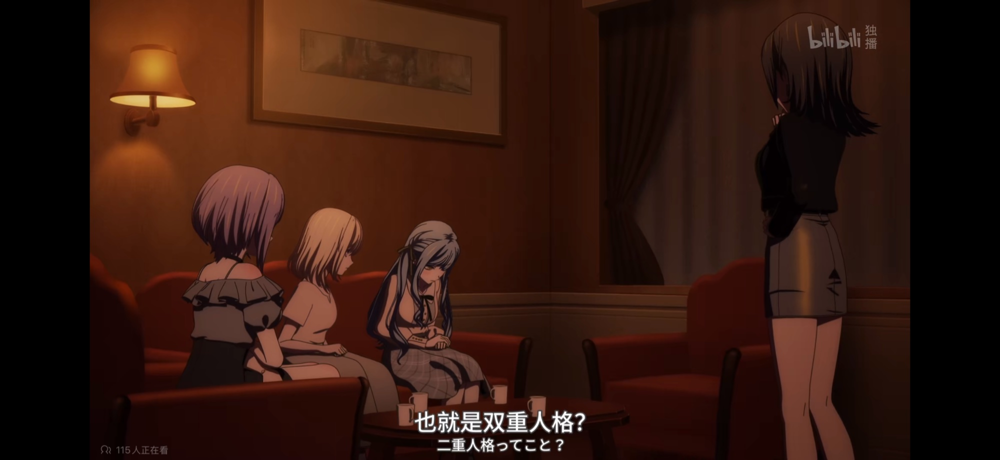
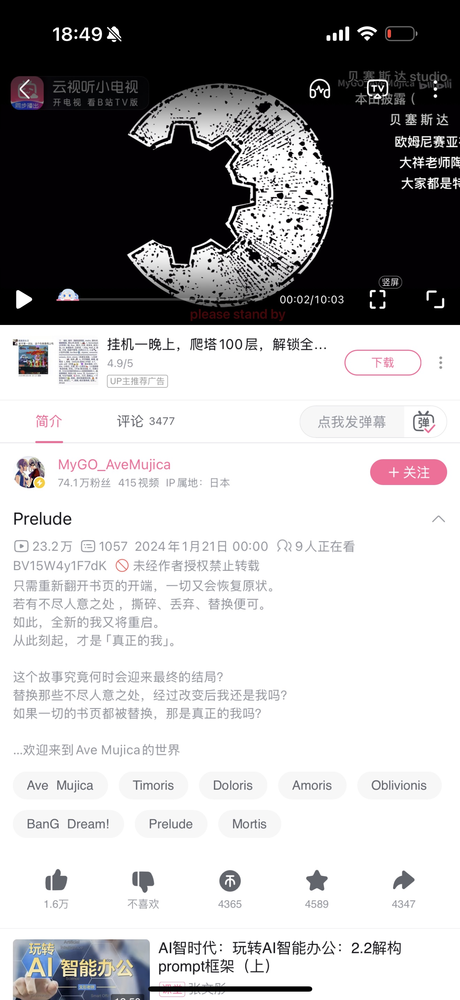

> 转：[https://tieba.baidu.com/p/9575305447](https://tieba.baidu.com/p/9575305447)

---

不知道大家有没有发现，三角初音其人，她嘴上说的话，与她的实际行动，其实是完全对不上的。

在心理学上有一个说法，叫做论迹不论心，那我们抛弃剧中人口头说的信息，来单纯的看三角初音的所有行为，大家有没有发现，如果按照众所周知的发展，三角初音无疑会是整部母鸡卡这个闹剧的最终赢家——不但得到了祥子的心与全心的信赖，与她同居，而且会被丰川家族唯一的继承人承认身份，给了丰川老登沉重的一击，在事业上既没有丢掉 sumimi（存疑），还会继续成为 mujica 银河战舰的主唱与门面，无论从哪方面来说，她都是最终的唯一赢家。

而在这个基础上，她在祥子心中却是需要她全力支持的，原谅的，脆弱的，自己的亲人与信赖的对象，并且为了她可以站在丰川老登的对立面，为她争取利益。

在考虑到这个最终结果的情况下，让我们来反推过程，你们就会发现，三角初音所做的一切行动，都是直接或者间接的将她与祥子与母鸡卡的众人，推到了这个结果上——无论是有意还是无意，她毫无疑问就是那个最初的起点，万恶之源，从 mygo 第一集开始，全部都是她最初开始行动的结果。

那有没有一种可能性，这一切，其实全部都是三角初音的策划呢？

她从最开始就是一个满口谎言的谎言编织者，从离开岛的那个时候开始，她所做的每一件事，全部都是对丰川老登与祥子的报复。

如果以这个前提，我们来重新看整部母鸡卡，你就会发现无论是故事情节，逻辑，人物行为，全部都有了合理的解释。

而且无论最后 2 集如何演绎，都不会推翻这个结果，因为这都是她的谎言与演绎，这个设定可以无痛解释初音全部的人物行为，可以直接替换掉她目前表演出的所有人设——她就是一个如同黑洞一般，心机深沉，心怀恶意，有意报复，并且付诸行动后，还会被所有人原谅的，谎言编织者。

（她口头上说的，全部都是谎言，但真心可以在歌词中一窥究竟。）
楼下正文，我会以这个前提来分析她所有的行动，你们会发现逻辑上几乎完美无缺，欢迎来辩。

故事的最开始，其实初音已经告诉了我们。

在岛上最高处的丰川家的大宅，有一个与她同龄的女孩子。

同样身为丰川家族的孩子，她受人祝福，幸福的生活着，而初音却不被人承认，甚至连靠近丰川家都不被允许，而这段的后续，初音真正的想法，在小剧场中她的内心独白中——

为什么那孩子可以幸福？可以被人祝福诞生，而我却不行？

我们有什么不同呢？是因为出生不同吗？

还是因为对方有着丰川家族那一脉相承的外表？而我却不同？

明明都是丰川家族的人，却被双重标准而践踏。

对此，初音的想法已经告诉了我们——

“我真想取而代之。”

关于在岛上与祥子玩耍的细节，全部都是初音自己说的，大家都已经发现了很多处不合理的地方，这里不详细说，她自己叙述的我们全部都理解成谎言就行，单看她做了什么。

目前我们可以得知——

1、初音知道自己的身份，也知道老登的身份。

2、她不被允许离开岛，不被允许接近丰川家的人。

3、她知道，只要自己私生女的身份曝光，老登可能就会倒台，她明白事情的严重性，但会阶段性的故意表现出忘记这一点。

在上面的这些条件下，我们来看初音做了什么。

首先，她隐瞒自己的身份（无论初华到底存在不存在，这都不重要），与祥子接触。

在接触过程中与祥子结下了友谊，为之后的事情做出铺垫。

然后，偷偷离开岛屿，来到东京，但在被星探相中后，却毫不犹豫的爆出了自己的父亲就是丰川老登。

这里是初音伪装的第一个破绽。

她在自己的诉说中，说是自己需要报出监护人的名字，才能继续当偶像，但其实她完全可以爆自己母亲的名字，但她没有。

她在明知事情严重性的情况下，毫不犹豫的将老登拖下了水，无论他是否愿意，都被迫成为了初音的后盾，让她可以迅速的主流出道，并且资源不断。

也就是初音在来到东京没有多久，就利用老登，让自己迅速站住了脚跟，这里的心机与试探其实是与之后她装出的无辜舔狗的形象完全矛盾的，甚至可以说是对丰川老登的威胁，如果你不当我的后盾，我就去直接找你，直接暴露自己的身份，让你在丰川家族失势，而丰川老登如她所愿，给了她资源与地位，并且在事务所上层中隐瞒住了她的存在，初音计划的第一步达成。

初音计划的第二步，就是与祥子的父亲，丰川中登接触。

上面我们说过了，初音明确的知道——只要自己的身份暴露，丰川老登很可能就会失势。

而在这种情况下，初音却装作毫无心机的样子，将自己的身份告知了丰川家族现在第二顺位继承人，丰川中登，并且拜托他，向自己的父亲，表示感谢。

好家伙，这里的操作真的好家伙。

在与丰川中登接触，知道他的为人后，初音诱导他，让他去找丰川老登代替自己，对老登表示感谢，也就是告诉丰川老登：“这个中登，已经知道我的存在了哦！要处理他，可要趁早呢。”

后面的事情，就如同初音所料，知道秘密的丰川中登，被老登毫不留情的设计陷害了。

初音这里的操作，几乎可以说是非常非常绝妙的一招，一石多鸟。

1、给了老登好大一个下马威，用自己的身份持续威胁老登。

2、让中登落马，毁掉了祥子的家庭。

3、间接摧毁了祥子的归宿，ccc，让她为了父亲，离开了丰川家，再也不是那个高高在上的大小姐，变成了与她一样的，不幸之人。

看到祥子落入这个境地后，初音在自述中说自己非常自责，但实际上，她什么也没有做，既没有帮助祥子，甚至也没有主动与她联系，出现在她面前施予援手，她甚至会陶醉的看着当初祥子发给自己的短信，却对祥子的困境不闻不问。

（这个不管不顾的时间，甚至长达一年。）

这就是我说的，初音这家伙，嘴上说的，与她实际做的，完全对不上。

我们只看她的行为——

此时她对于祥子的困境，其实是乐见其成，甚至是有些欣喜的。

她旁观着祥子的不幸，欣赏着对方的困境，终于将那个高高在上的公主，拉下了泥潭。

她的报复本来就到此先告一段落。

但在这种时候，祥子却主动向她求助。

这对于初音来说，看着向她请求要组乐队的祥子，看着那个高高在上却向自己低头请求的，丰川家的女儿。

初音是怎么做的？

她明白，自己的机会来了。

这是一个彻底的，彻底的将祥子打入地狱的机会。

她毫不犹豫的接受了祥子的提议，明明知道对方的困境，却装作对此一无所知，表面上对祥子很关心，实际上，却几乎没有提供任何有用的支持。

在母鸡卡成立后，我们可以发现，初音几乎做的一直都是嘴上说着自己是祥子的伙伴，实际上都在拖对方后腿。

这里我们一集一集的来分析她做了什么，我们还是不看她说什么，只看她做了什么。

第一集：【配合喵梦，摘下面具。】

母鸡卡成立后第一个事件——喵梦摘面具。

这个事件可以说是之后母鸡卡分崩离析的导火索，但在祥子明确摇头拒绝后，初华依旧是摘下了面具，将祥子彻底推到了漩涡之中

第二集：【不责备喵梦，不来母鸡卡排练，发现了睦的异常，什么也没有做，甚至将大部分母鸡卡商单都推给了睦】

在摘下面具后，初音在祥子与喵梦对峙中，没有支持祥子，反而是表达了自己对喵梦的理解，这让母鸡卡队内矛盾彻底激化。

而此时的她第一时间发现了睦的异常，但她对此乐见其成，因为睦是祥子的天然盟友，想要彻底击溃祥子，必须先从睦这里下手。

所以初华不光对睦的异常不管不问，甚至以 sumimi 那里事情很多为由，故意将母鸡卡的大部分事务全部都推给了睦，进一步摧毁睦。

（事后我们会得知，这段时间 sumimi 的真奈一直都在做个人发展，sumimi 其实根本没有那么多工作，但她就是不去母鸡卡的排练，在暗中观察激化矛盾。）

第三集：【在地铁大战说出了：有人退出就意味着解散这句话，看着帮祥子说话，但实际上在路线之争中，没有表明支持祥子的态度，对祥睦决裂袖手旁观。】

在地铁大战的时候，在喵梦与祥子对峙的时候，初音听到了解散关键词，想到了一个绝妙的主意，那就是给母鸡卡下了一个定论：“只要有人退出，母鸡卡就相当于解散。”

——这几乎是断了睦的退路。

这里其实是告诉睦，如果你要退出，母鸡卡就要解散，所以睦即使状态越来越差，却只能坚持下去。

而且在母鸡卡的路线之争中，初音故意不表态，甚至暗自支持喵梦，放任喵梦却压力睦，进一步给她压力。

就这样在她的暗中推波助澜下，睦与祥子正式决裂了。并且睦彻底坏掉了，成为了祥子的对立面。

第四集：【支持莫提斯，孤立祥子，多次与祥子唱反调，将睦人格分裂这件事告诉众人，在酒店大战中，一直在边缘 ob，对母鸡卡解散推波助澜。】

在睦与祥子决裂后，初音马上转而支持睦，与其他人一起孤立祥子。

而在睦坏掉了，自认为的朋友初华却一直站在自己对立面的情况下，祥子在母鸡卡队内的情况越来越艰难。

而在莫提斯说出自己：“不会弹吉他”后，初音明白，彻底摧毁祥子的时机，已经到来了。

她先是在暗中躲藏，听到了莫提斯与祥子的对峙，明白了莫提斯现在的情况，她对此毫无关心，甚至有些欣喜，然后在莫提斯走后，第一时间出现，将祥子带回了酒店。

此时的祥子是心乱如麻，完全无法正常思考的。

所以，能将母鸡卡众人召集起来的人，就只能是在场的另一个人，初音了。

初音在祥子无法正常思考的情况下，马上就将所有人召集了起来，并且将睦现在人格分裂的情况告知。

让大家产生了一种强烈的不信任感。

然后故意晚了一步，将莫提斯叫了过来的（这里叫莫提斯的，只可能是初音，喵梦害怕莫提斯，海玲跟她不熟，祥子此时还在混乱。）

不会弹吉他的，人格分裂的莫提斯的出现，一下子激化了母鸡卡队内的矛盾。

而且初音曾经给母鸡卡下过一个定义：有人退出，就意味着队伍解散。

在这个时间点，她故意引导出了这个问题——莫提斯不会弹吉他，母鸡卡要怎么办？

在当时那种大家其实都很混乱的情况下，母鸡卡果然开始崩溃。

初音本来还打算继续推波助澜，但此时被初华叫过来的莫提斯，隐约察觉到了不对又不知道问题在哪里，就本能说了一句：“初华一直都在说谎。”

让初音有所惊觉，自己表现的太明显了，这可不行，在这场解散闹剧中，自己必须是无辜被牵连的那个，所以她马上闭嘴，后续什么话也没说，但在她不说话的情况下，其实也就表明了自己默认的态度，最后果然如她所料，母鸡卡就这样解散了，祥子还在混乱的情况下，就这样被打入了地狱。

第五集：【违约金对她没有任何影响，对祥子回去做客服，依旧袖手旁观】

在母鸡卡解散后，只有祥子疯狂收到了事务所的信息，而初音等人没有任何影响，也就是除了祥子外，唯一可以与事务所联系的人——初音告知事务所人员，丰川家的大小姐祥子会一力承担所有违约金（所以后续会被成员说是大小姐过家家）。

将所有违约金推给祥子后，初音打算以一副救世主的姿态出现在祥子面前，成为她唯一的依靠。

但没有想到，祥子却没有依靠她，离开了初音的住所。

我们从初音自己暴露出来的信息可以得知，初音是知道祥子跟中登住在哪里的。

在发现祥子离开后，她肯定第一时间去观察了中登的住所，然后知道祥子回去了，而且再次开始打工还债。

但是初音，对此，什么也没有做。

——？

这里就是她暴露给我们的，第二个破绽。

如果她真是一个一心为了祥子的，全身心为了她付出的孩子，又怎么会坐视祥子受苦还债，而她却什么都没有做呢？

但事实上，她就是什么也没有做，放任祥子回到了地狱之中。

此时她对祥子的复仇其实就已经告一段落了，她以为祥子会就此沉沦，没有想到老登会接祥子回去。

因为在她印象中，祥子是不会轻易放弃中登的，但没想到中登不做人，或者说是故意赶走了祥子，让祥子回家了。

这些初音是不知情的，她的复仇告一段落，所以暂时退出了舞台。

所以从第五集后面开始，她的报幕就消失了，因为之后的发展是她没有预料到的。

第八集：【看到了短信】

初音的视角从第五集后段一直消失到了第八集她看到了 ccc 的信息，此时她心中有了不好的预感，再次开始插手事件，此时报幕出现，显示出了初音开始介入。

第九集【收集情报，煽动海玲，与海玲一起逼宫】

在看到 ccc 的账号发出了信息了，初音意识到事情开始朝着她没有预料的方向发展了，于是立马找到了爱音了解情况。

在看到祥子再次露出幸福的笑容，初华破防了。

为什么，明明自己已经将她打入了地狱，她却再次找回了幸福的归宿？

所以重建 ccc，让祥子重新幸福起来，这是绝对，不允许的。

初音再次开始行动了起来，她先是找到了海玲，告诉她自己也想组母鸡卡，煽动海玲的情绪。

然后她本来打算利用自己的身份，来让事务所重组母鸡卡，从而打断 ccc 的重组，但此时，一直都注意到初音行动的老登出手了，阻止了她再继续下去。

（这里说一下我觉得老登其实一直都对初音的行动有所察觉，但他其实一直都是放任不管的，大概还是因为对初音心怀愧疚，但后面她做的太过分了，老登不的不出手干预了。）

事务所这条路走不通，初音开始想其他的办法，她在偶遇灯后，然后告诉灯她的歌是 go 团的歌曲，动摇了灯的决心，然后在祥子与 ccc 人见面商量重组，故意带着海玲与莫提斯上门逼宫，逼迫祥子。

这里可以发现，初音在面对祥子的事情上，从来不会自己亲自动手，而是会借助其他人来逼迫祥子，而将自己摘出去，成为一个旁观者，所以在祥子心中，她从来都不是那个逼迫自己的人，而是自己需要承担责任的人，非常高明的手段。

第十集：【写歌词逼迫祥子，与喵梦上门堵人，去丰川宅打破了老登的底线】

在经过了第九集打断了 ccc 重组后，初华开始写歌词逼迫祥子，但这个歌词不能由自己发，在她犹豫的时候，喵梦出现了，初音故意透露出自己知道祥子家住在哪里，然后与喵梦一起上门开盒。

本来不被允许进入的丰川家第一次踏入，让初音没能第一时间做好伪装，大家可以发现，她在见到心心念念的祥子后，没有第一时间看向她，而是看向了丰川宅周围，然后放任喵梦逼迫祥子，可以说是用一种非常激进的手段，逼迫祥子承担责任，而祥子最终也被当成的承诺所裹挟，妥协了，放弃了 ccc，重新回来组让她不会幸福的母鸡卡。

但自始至终，逼迫祥子的不是初音，她虽然是写歌词的那个人，是提供祥子住址的那个人，是带着喵梦过来的那个人，但她不是逼迫祥子的那个人，她是祥子需要承担责任的那个人，至少在祥子眼中是这样的。

（当然此时她的心情在歌词中其实暗自流露了出来，“将逐渐虚弱的你，紧紧关注。”

所以，在母鸡卡重组的过程中，初华看似什么都没有做，但她其实一直都在煽动其他人逼迫祥子，并且在最后给予祥子致命一击：“我将自己的人生全部给你”。

这让祥子无论愿意与否，都被困在了这个名为母鸡卡的牢笼中，再也无法离开。

所以后面初音明明看出了祥子的状态不对，但她却装作什么都没看出来，独自一人沉浸在了计划成功的欣喜之中。

第十一集：【在一瞬间给自己编好了剧本，并且断联玩失踪，逼着祥子去找她。】

因为她出现在了丰川宅，打破了老登的底线，一直都放任她不管的老登终于出面，警告了她，并且开始赶她回去。

（老登其实对她的存在一直都是默认的，这里是她做的太过于露骨了，让老登明白无法再放任她了，所以直接就当着祥子的面揭穿了她的身份，并且警告祥子，不要再见初音了，那家伙很危险，甚至想要将祥子送去国外。）

但这里对初音是危机，但其实也是契机。

在她一瞬间想好了所有的说辞（就是 11 集的脑内剧场，这是她给自己编的剧本），将自己伪装成了一个对祥子卑微爱着的人，诉说了自己的爱意，然后故意切断了与祥子所有的联系，装作伤心失望回乡。

初音对于祥子会来找自己非常自信，没有人可以接受这样的离别，更别说祥子承诺过会承担起她的人生，并且一直都对自己心存感激，更何况，她表现的是如此的爱祥子。

这是一招非常绝妙的以退为进。

因为她在祥子面前，一直都是一个需要她拯救的“悲剧的女主角”，而在祥子选择去见她的同时，就意味着丰川老登的彻底失败。

她彻底夺走了丰川家族唯一继承人的心，自己的存在被如此明确的摆在了丰川家人的眼中，再也没有人可以忽视她，而且温柔的祥子肯定会为她打抱不平的。

在争取到了祥子的支持后，老登可以说是在这场战役中，彻底的一败涂地。

故事发展到了现在，三角初音的复仇计划，即将迎来了最后的胜利。

在这个人偶疯狂舞动的舞台上，到底谁才是那个幕后操纵一切的人偶师呢？

她是舞台上悲剧的女主角，是需要被祥子拯救，是需要被祥子原谅，是需要被祥子追回的重要之人。

她再也不是一个就连身份都无法说出口的私生子，而是这场祥子争夺战中最后的赢家。

曾经高高在上的公主成为了自己触手可及的存在，而看不起自己的父亲也要永远都面对着自己。

舞台落幕，大家大声嘲笑着舞台上的小丑，而小丑摘下面具，面具之下，是另一张带着面具的笑容。

这就是我这个曾经初华厨能给现在的三角初音编写的最好也是最后的剧本了，无论如何，祝所有人，最终都能幸福，哪怕只不过是虚无的假象，也肯定会有人因此得到救赎。

初音，祝你幸福。

补充一个论据，在官方预告视频《序曲》中，简介上那个替换扭曲丢弃剧本的不尽如人意之处，我将成为新的我的这个人是谁，已经不需要多说了。

在这一话，那个一边读剧本一边翻页替换更改剧本的那个角色，官方已经告诉我们了。

第十二集【说着离开东京，却没有退租东京的房子，知道老登在等祥子，却依然把祥子带了过去没有提醒。明知道祥子喜欢红茶却依然泡了 2 杯咖啡】

十二集中，初华说要转学回岛上当公寓管理人，但实际上她并没有退租东京的房子，也没有去找她的母亲，而且默默回到了岛上等待祥子的到来。

然后在一番诉说自己 11 话编好的剧本后，如她所料的得到了祥子的原谅，被她以自己必须负责的，可怜的女主角的身份带回了东京。

然后在明知老登等着的情况下，也没有提醒祥子，就直接把祥子带到了老登面前，让两人面对面冲突，果然如她所料的决裂了。

接下来又是初音的破绽。

当初大家用来区分初音初华双子的月亮星星衬衣，其中本该是初华的星星衬衣，被拿给了祥子穿，所以当初到底是？初华到底……

这大概会是一个永远的迷了。

另，此时大获全胜，从老登那里彻底夺走了祥子的初音，终于忍不住露出了一些端倪。

那就是明知道祥子喜欢红茶，却依旧以自己的喜好，泡了 2 杯咖啡，用来宣布自己最后的胜利。

而隐约察觉到了什么，但心有所觉亦作不解的祥子，还是甘愿暂时闭上双眼，装作什么都没有发现。

然后小声说了一句： 这个气味，真讨厌。

两人看起来成为了一起逃脱的共犯，但其实貌合神离，却又被命运牢牢的捆绑在了一起，真是，太美味了。

而初音也终于收紧了自己的蛛丝，美味的猎物，再也无法逃离。

三角初音最终还是成功了，她即使在岛上的时候，也依旧提供的是祥子不喜欢的咖啡，同居后也依然坚持让祥子喝咖啡，就如同她所说的，祥子只不过是她成为悲剧女主角的舞台装置，是最后是拯救悲剧女主角的人偶一样的主人公，实际上，这出人偶剧最后也获得了成功，无论祥子的真心如何，她最终都被困在了名为 avemnjica 的牢笼之中，歌颂着虚假的幸福，而初华就如同她的犯罪预告——囚禁曲一样，终于将高高在上的月亮囚禁在了洁白的蛛丝之中，再也无法逃脱。
