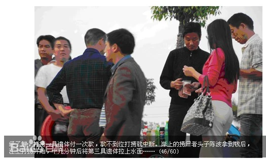
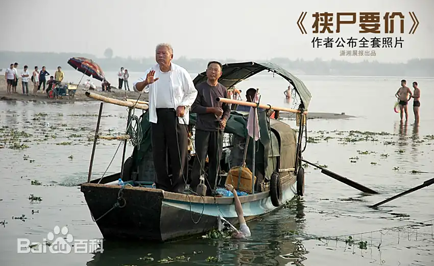

> 转：[挟尸要价\_百度百科](https://baike.baidu.com/item/挟尸要价/3010412)

<!-- > 转：[挟尸要价\_百度百科](https://baike.baidu.com/item/%E6%8C%9F%E5%B0%B8%E8%A6%81%E4%BB%B7/3010412) -->

---

## 挟尸要价

##### 一副新闻照片作品

《挟尸要价》，是一幅新闻照片作品。该片是由《华商报》首发，《江汉商报》摄影记者张轶拍摄。照片素材来源于 2009 年 10 月 24 日湖北荆州大学生何东旭、方招、陈及时为救溺水儿童壮烈牺牲，而打捞公司打捞尸体时竟然漫天要价，面对同学们的“跪求”，个体打捞者不仅不为所动，而且挟尸要价，一共收取了 3.6 万元的捞尸费的事情。

2010 年，《挟尸要价》夺得了中国新闻摄影最高荣誉金镜头奖。而照片的获奖，引来一片质疑之声。人民摄影“金镜头”评委会针对《挟尸要价》图片所涉及的新闻事实的调查结论认为，尽管照片中王守海所做手势存在争议，但“不再对此细节深究”。

2015 年 11 月四川攀枝花市，出现“挟尸要价”现象。2017 年 7 月 7 日，河北保定也出现“挟尸要价”现象。 [1-2]

中文名 挟尸要价
作 者 张轶
首 发 华商报
获 奖 金镜头奖
地 点 湖北
举行时间 2010 年 8 月 18 日

<!-- ## 相关视频 -->

相关视频

目录
1 作品简介
2 作品背景
3 照片争议
▪ 尺度争议
▪ 全套照片
▪ 真与假
4 作者解读
5 解读质疑
▪ 李玉泉
▪ 质疑
▪ 记者回应
6 官方结论
▪ 新闻发布
▪ 政府结论
7 手势争议
8 作者去世
9 扩展阅读
10 川版挟尸要价
▪ 事件经过
▪ 家属看法
▪ 渔民看法
▪ 事件还原
11 保定挟尸要价

## 作品简介

2010 年 8 月 18 日，中国新闻摄影最高荣誉“金镜头”颁奖盛典在青岛举行。一幅揭露社会公德缺失的作品《挟尸要价》以全票赢得了本年度最佳新闻照片奖，成为颁奖典礼上的焦点。 [3]

2010 全国摄影艺术展览评选结果揭晓，共产生各类收藏、优秀、评委推荐作品 904 幅（组），其中金质收藏作品 15 幅（组），银质收藏作品 30 幅（组），铜质收藏作品 54 幅（组），优秀作品 785 幅（组），“评委推荐作品”20 幅（组）。“挟尸要价”获记录类银质。

2010 年 1 月 23 日，第 18 届金镜头比赛暨华赛中国作品初评结果揭晓，《挟尸要价》获得年度最佳新闻照片奖。2010 年 2 月 4 日，在中国记协主办的“2009 中国瞬间中国新闻摄影大赛（第三届）”上，《挟尸要价》获一等奖。 [4]2013 年 5 月 22 日，《潇湘晨报》记者张轶因肝癌医治无效，于当天 14 时逝世，年仅 28 岁。

《吕氏春秋》：洧水甚大（洧音伟），郑之富人有溺者，人得其死者，富人请赎之，其人求金甚多，以告邓析，邓析曰：安之，人必莫之卖矣。得死者患之，以告邓析，邓析又答之曰：安之，此必无所更买矣。

## 作品背景

2009 年 10 月 24 日，长江大学陈及时、何东旭、方招等 15 名同学在长江荆州宝塔湾江段野炊时因救两名落水儿童，陈及时、方招、何东旭三名同学不幸被江水吞没，献出了年轻的生命。

而打捞公司打捞尸体时竟然漫天要价，面对同学们的“跪求”，个体打捞者不仅不为所动，而且挟尸要价，一共收取了 3.6 万元的捞尸费的事情。

此事件曾被媒体广泛关注，舆论一致谴责挟尸要价的行为突破了社会道德底线，羞辱了所有国人。 [5]

## 照片争议

### 尺度争议

2010 年全国摄影艺术展览评选揭晓,《挟尸要价》照片获得了记录类银奖，一时之间,网络上对这张获奖照片议论纷纷，莫衷一是。

《挟尸要价》的素材来源于湖北荆州大学生为救溺水儿童壮烈牺牲,而打捞公司打捞尸体竟然漫天要价的事情。然而，反映该事件的这张新闻照片的获奖还是引起了舆论纷争。

该照片把人性的善和恶展现得一览无遗：水中是因勇救落水儿童而牺牲的青年的遗体，船上是用两根冰冷的绳索拉着英雄遗体正在讨价还价的两个中老年打捞客。很多人认为这幅照片不该获奖，因为再次展示英雄的尸体那是对英雄的不尊重。一些网友直接质疑，如果死者的家属看到了这张照片，那该是什么样的感受？如果仅仅是为了警示一种“恶”，我们有必要以对逝者亲人的二次伤害为代价吗？从情感上讲，很多人都不认同这张照片获奖，因为它不够“人性”。

可事实上，这已经不是《挟尸要价》照片第一次获奖了。2010 年 1 月 23 日，第 18 届金镜头比赛暨华赛中国作品初评结果揭晓，《挟尸要价》获得年度最佳新闻照片奖；2010 年 2 月 4 日，中国记协主办的“2009 中国瞬间中国新闻摄影大赛(第三届)”揭晓，《挟尸要价》获一等奖。算上全国摄影艺术展评选，这已是《挟尸要价》第三次获奖了。一张引起巨大争议的新闻照片连连获奖，难道评委们真的“冷血”?

该照片连连获奖，即便是作者张轶本人也颇感意外，毕竟展示“负面的东西获奖的机会少之又少”。无论观者的感受如何异样，这张照片都真实地展示了当下社会的一种弊病,展示出来的痛如针芒一样直指人心。不夸张地说,这是社会中一种真实影像的缩影。我们又有何理由拒绝它获奖呢？难道真实地反映现实、针砭时弊直指丑恶现象的作品不能获奖吗？难道真正的艺术必须脱离观者的朴素感受而高蹈吗?

说白了，我们对《挟尸要价》照片获奖的纠结，本质上可能还是对艺术之于社会关系理解得不透彻。必须正视的是，有时候艺术在体现公共关怀时未必能够照顾到所有个体的感受，从一定程度上说,这样的矛盾也是不可消弭的。照片《挟尸要价》整体上试图通过展示一种丑恶来告诉观者，失范的环境下究竟缺少了什么，其间无意识的对英雄的“伤害”，我们是不是该宽容一些呢？

我们可以理解观者在《挟尸要价》上的情感纠结，但是，动辄就以“通过展示国人的丑恶”或者以虚无的“伤害”为由抗拒《挟尸要价》获奖，这样的理由还是有些武断了。 [6]

### 全套照片

2010 年 8 月 18 日，中国新闻摄影最高荣誉“金镜头”奖颁出，《挟尸要价》以全票赢得最佳新闻照片奖。第二天，长江大学李玉泉发文称该照片被误读，建议组委会和评委会撤销该照片的获奖资格。一时间，网络沸腾。20 日下午，作者张轶从青岛赶回武汉，给潇湘晨报发来全套照片，希望结束一切有关照片真假的争议。 [7]

### 真与假

人民网北京 8 月 20 日电　享有“中国荷赛”之称的“金镜头”奖 18 日颁出，曾震惊舆论的的照片《挟尸要价》以全票赢得本年度最佳新闻照片奖，此前，这张照片已获华赛中国作品初评的年度最佳新闻照片奖等几项大奖。大家在为此照片所揭露的人性黑暗所唏嘘时，长江大学党委宣传部部长李玉泉 17 日却刊文，质疑《挟尸要价》照片真实性。为了解事实的真相，人民网记者第一时间联系了“金镜头”奖的两位评委，京华时报社图片总监骆永红、人民日报摄影部主任李舸以及对事件进行实地调查的记者郝建国，两位评委均表示在对《挟尸要价》评审之前，评委会已经对图片拍摄过程以及真实性进行了调查，并未发现任何问题。李舸坦言，此照片可以全票获奖是因为两个原因，第一照片很直观，表达清晰准确，并十分具有冲击力；第二照片所拍摄的新闻事件本身就具有很强的震撼力，所以得到了评委会一致认可。就李玉泉质疑照片真实一事，李舸表示，质疑必须要有证据，要有确凿的证据。事发后曾调查采访此事的记者郝建国称，自己通过现场的长江大学学生、冬泳爱好者、目击者等多个信息源证实，捞尸者“挟尸要价”铁证如山。

仔细察看长江日报宣传部部长李玉泉所刊发的文章《“牵尸谈价”：不能不说的事实真相》一文和媒体报道，对《挟尸要价》照片的质疑主要集中在四点：

1、媒体解读：船头着白色衬衫者与老师、学生牵着尸体谈价。

李玉泉质疑：在打捞中，两条船共同作业，着白色衬衫者手牵尸体挥舞手臂是指挥岸上的 人们配合将尸体打捞上岸。

记者郝建国调查：图片定格瞬间画面是，捞尸者以答应的 36000 元还没有全部到位为由“罢工”，一个叫王守海的捞尸者，把打捞上来的方招的遗体用一条绳子绑住右手（图片上绳子打结很清晰），用另一条带铁钩的绳子钩住 T 恤，久久将遗体横在水中，而不是拖到船上。当时岸上的同学们哭喊着抗议这样的行为，但王守海摆手不动（请注意王守海的表情和手势，当时校方答应的 36000 元尚未全部到手）。王守海等人这样侮辱英雄遗体，目的是调动岸上老师和同学们怜悯和痛心，以及时拿到他们开出的 36000 元天价捞尸费。

人民网记者：“着白色衬衫者手牵尸体挥舞手臂是指挥岸上的人们配合将尸体打捞上岸”，这是李玉泉误读。当时，方招的右手和 T 恤已分别被两条绳子固定，绳子的另一端分别由捞尸者王守海还另一位穿蓝色衬衫的男子牵着，完全有条件把遗体拖到船上，不存在岸上配合的问题。《挟尸要价》引起大家愤怒的是，捞尸者“漫天要价”和“拿不到钱不捞尸”（学生将捞尸者误解为“见死不救”，当地警方调查的结论是“中断打捞”）。

2、图片解读：船头着白色衬衫的捞尸人姓陈

李玉泉质疑：据有人证实，这名捞尸人不姓陈，而是叫王守海。

记者郝建国调查：王守海，湖北公安县农民，受雇于捞尸头子陈波，先前的报道曾误为“陈某”，后《华商报》予以及时纠正。

荆州市人民政府：“荆州市八凌打捞有限公司”的陈波行为已构成敲诈勒索，公安机关已依法将其治安拘留，拘留时间是 15 天，并处 1000 元罚款。

人民网记者：陈波已经被公安机关拘留，如果是像李玉泉说的那样，陈波为何被拘？

3、图片解读：打捞者漫天要价

李玉泉质疑：渔民陈凯说“捞到人，我们每船每次能得 500 元，捞不到就是 200 元，甚至有时给包烟。”可见 ，如果谈价，也不是由船上从事打捞的这些人。

记者郝建国调查：本人通过现场长江大学的学生、冬泳爱好者、目击者（照片《挟尸要价》拍摄者张轶）了解到的事实是：捞尸者赶到现场后，不问英雄的死活，不顾现场师生的感受，趁火打劫，开口就要钱，称捞一具遗体 12000 元，钱不到位不捞。渔民的船在 10 月 29 日后受到岸上群众的攻击是事实，但《挟尸要价》还未发表（该照片首发于《华商报》2010 年 11 月 3 日）。

荆州市人民政府：长江大学与荆州市八凌打捞有限公司打捞尸体的协议系民事行为，但其八凌公司打捞过程中的言行明显违背社会公德。虽尸体打捞价格不在物价部门定价范围之列，但八凌公司明知溺水学生系见义勇为遇难而不及时打捞，特别是因打捞资金未筹集到位时，数次中断打捞，明显违背社会公德。

4、有媒体质疑，怀疑获奖人为“张轶”是假名，就此事记者采访了解确认张轶是真名。张轶拍摄这张照片后，他所供职的《江汉商报》由于种种考虑并未刊发，张轶以个人的名义在《华商报》首发该照片，署名“真真”，以目击者身份署名。后因屡获大奖，记者张轶身份被迫公开，现由于在当地压力过大已离开荆州。

## 作者解读

中国新闻摄影最高荣誉“金镜头”颁出，《挟尸要价》以全票夺得本年度最佳新闻图片奖。随后，长江大学党委宣传部部长李玉泉公开质疑对照片的解读的真实性，真假之争由此引发了舆论的热议。《挟尸要价》作者张轶在回应中称“很淡然，对此不感到意外”，得知获奖消息后已有接受指责和质疑的心理准备。

据张轶介绍，当地捞尸收钱已成惯例，自己在事发后当时拍到了几个英雄被打捞以及停靠的过程，还有谈价格、老板数钱的过程。

张轶说，那些捞尸人停在那里抽烟喝水花了一个小时，但是老板收到钱以后不到 20 分钟，尸体就被打捞上来，而那张获奖照片上所记录的少年英雄方招的尸体在送上岸之前，已经被打捞，但是他被一直在水底下沉着，一直没有往上提，因为钱没有到位。后来钱到位之后他才提上来。这些过程照片张轶都完整的记录了下来。

如果还有人质疑照片的真假，张轶将会把当时拍的所有片子都放出去。而且当地政府在立案的时候，已经承认“挟尸要价”，并不是长江大学宣传部部长所说的“挟尸靠岸”。

图片刊发以后，张轶离开荆州，去了湖南。他称因为受到了当地黑社会的威胁，因为图片的揭露，触犯了船老板和黑社会的利益关系。

## 解读质疑

### 李玉泉

李玉泉是时任长江大学党委宣传部部长，溺水事件发生到打捞尸体的整个过程中，李玉泉并不在场。但在事件发生后，他多次通报事件“真相”，并称公众和媒体对照片的解读是错误的。

### 质疑

这张照片在《华商报》发表、经《新京报》转载后，《南方周末》记者杨继斌经过调查 2009 年 11 月 4 日在湖北荆州发出了《大学生救人溺亡隐情调查：“挟尸要价”另有其人“见死不救”渔民被冤》的调查报道，并被广泛转载；媒体人马文娟 2009 年 11 月 8 日撰写了《从大学生救人事件的报道看媒体责任》一文，提出有关媒体对大众的误导要承担责任；长江大学宣传部长李玉泉也向新闻媒体通报了事实真相，并在 2009 年 11 月 17 日在自己的署名博客上发表了《“牵尸谈价”：不能不说的事实真相》的文章。就此，舆论和大众基本都已了解了事实真相。

《华商报》和《新京报》对照片的解读是：船头着白色衬衫者陈某与老师、学生牵着尸体谈价。事实是：在打捞中，两条船共同作业，捞到后要迅速地用绳子拴着手或脚，避免再次滑落水中，船太小，在深水处不容易把尸体捞上来，要牵引到岸边再捞起。着白色衬衫者手牵尸体挥舞手臂是指挥岸上的人们配合将尸体打捞上岸。但误读的结果使“牵尸靠岸”在《华商报》和《新京报》的报道中变成了“牵尸谈价”。而且，该照片在《华商报》和《新京报》发表时署名为“真真”，获奖人为“张轶”，我们有理由怀疑，这两个名字可能用的都是假名。

追求事件的真相是每一个没有亲临现场的人们所期望的，也是媒体代言大众应该向大众转达的。亲临现场的人们如果对某一个场面产生了误读，可能只是导致自己对事件的了解不全面或不理解，但媒体的误读就会误导社会大众。《华商报》和《新京报》对照片的误读误导了全国大众，各种媒体口诛笔伐，人们在网上发贴咒骂“渔民”的没有人性，甚至咒骂“荆州人”的“冷血”。尽管调查报告已经公布，有关方面已经澄清，但“非事实”的造假新闻在社会中一直传播并引起人们对这个社会或人性的“失望”。

#### 完整的场景应该是：

两船合力将尸体牵引到岸边，捞起一具送到岸边一具，再打捞下一具，荡漾的水波显示船的划动。据有人证实，这名捞尸人不姓陈，而是叫王守海。

渔民陈凯说“捞到人，我们每船每次能得 500 元，捞不到就是 200 元，甚至有时给包烟。”可见，如果谈价，也不是由船上从事打捞的这些人。因为我们对“渔民见死不救”的误传，已经使本来应该列入“救人集体”的两个老人不敢出江，不敢见人，不敢与人打招呼。老人在宝塔湾卖鱼。他被人打了三个耳光，腰上踹了一脚。“无数的砖头瓦砾向我扔来，几百人围过来，他们大声指责谩骂，有人喊打死他，打死他，这个没良心的老东西，见死不救的畜生。”最后，船被砸了，渔网也被烧了。那么，因为我们对照片的误读而使这四个老人的生活举步维艰，善良的人们又于心何忍？

在 2010 年 8 月 5 日公布《挟尸要价》照片获得全国摄影艺术展记录类银质奖之后，长江大学宣传部已经向“全国摄影艺术展评委会和各位评委”发出了“就张轶《挟尸要价》照片获全国摄影艺术展记录类银质奖致评委会的公开信”。今天，就该照片获得“中国新闻摄影最高荣誉”，我们还要发出呼吁：

1、 建议有关主管部门核实照片的真实性和新闻性；

2、 建议组委会和评委会撤消该照片的获奖资格；

3、 通报作者的弄虚作假做法，以杜绝以后评奖中类似情况的出现。

4、严格参赛规章制度，以确保参赛作品的质量保证。

愿善良的人们都能擦亮眼睛，看清真正的事实真相。 [6]

### 记者回应

2010 年 8 月 20 日，当年首先刊登照片的《华商报》记者郝建国在个人博客发表一篇名为《郝建国对“挟尸要价”的最新声明——兼回复长江大学宣传部长李玉泉》的博文，博文详述了现场情况及《挟尸要价》图片中的信息，“当时并不在现场的长江大学宣传部长李玉泉称记者误读照片，制造假新闻，无疑是继挟尸要价事件之后又一大丑闻！” [8]2010 年 12 月，《新闻实践》刊发郝建国撰写的题为《从记者编码和读者解码看新闻的真实性———《挟尸要价》报道者的审视和反思》的文章，称“以张轶这一消息来源为主，参考其他 8 个消息来源（长江大学学生高阳等 3 人、现场参与救援的冬泳爱好者鲁德忠等 2 人、现场直接观察者《江汉商报》记者张轶等 2 人、长江航运警方 1 人），一个基本的新闻事实得以呈现——赢利性捞尸者漫天要价、先交钱后捞尸、不交钱不捞尸、不交钱不交尸，这就是所谓的‘挟尸要价’。”

该文认为：

“挟尸要价”的“挟”，有“挟制”和“挟持”两层意思。赢利性捞尸组织者陈波等人赶到现场后，开口就要钱，扬言“只捞尸体”、“白天 12000 元，晚上 18000 元”、“钱不到位不捞”，这里“挟尸要价”的“挟”是挟制的意思。具体捞尸人王守海等人找到了方招的遗体并用绳子固定后，因为“钱不到位”而“中断打捞”，此处“挟尸要价”的“挟”是挟持的意思。

## 官方结论

### 新闻发布

荆州市人民政府 2009 年 11 月 7 日召开新闻发布会，向社会通报打捞三名大学生英雄遗体全过程。

根据荆州市委市政府领导的要求，市政府办、市委宣传部、市政法委、市政府法制办、市信访局、市公安局、市工商局、市物价局、长江航运公安局荆州分局和长江大学组建了工作专班。

调查组查明，当日 14 时 40 分左右，长江大学教师史千里接到电话，于 15 时 20 分左右赶到事发现场。他到达现场后，发现有两艘蓝色船舷的铁皮船停靠岸边。史千里上船请求船主马上打捞落水学生，并保证支付打捞费。

船上的人称要先和老板联系，史千里与陈波电话联系时，陈波称“捞一具遗体 1．2 万元，没捞上来 6000 元，而且要先交押金。”直到长江大学文理学院汪书记等赶到现场凑齐 4000 元现金后，打捞船才开始工作。10 多分钟后，捞起第一具遗体，因未交足 1．2 万元打捞费，打捞船只停止打捞。后经过文理学院领导汪书记等做工作，打捞船在 20 多分钟后，捞起第二具遗体。之后，打捞船再次停止打捞，中间中断 1 个小时左右，文理学院会计潘林将筹来的 2 万元现金送到后，打捞船才继续打捞。约半小时后，捞起第三具遗体。最后在 18 时左右打捞结束。 [9]

### 政府结论

荆州市人民政府新闻发言人办公室

根据市委、市政府“10.24”事件调查组的统一安排，荆州市公安局会同长航公安局荆州分局组织专

班对“荆州市八凌打捞服务有限公司”的基本情况特别是打捞遗体的情况进行了认真调查侦查，现将调查

侦查情况公布如下：

一、“荆州市八凌打捞服务有限公司”（以下简称“八凌打捞公司”）的基本情况

1、“八凌打捞公司”组成人员基本情况

夏兵：男，1966 年 1 月 21 日生，“八凌打捞公司”执行董事、经理（法定代表人），家住湖北省荆州市沙市区纯正街金龙花园 13 栋 3 单元 302 室，原沙市环卫局环卫工人。

谢在斌：男，1948 年 4 月 11 日生，“八凌打捞公司”监事，家住湖北省荆州市沙市区金龙路 6 栋 1 单元 317 室，原沙市南湖机械厂职工（注：谢在斌与夏兵系舅甥关系）。

陈波：男，1970 年 4 月 29 日生，“八凌打捞公司”业务负责人，荆州市公安县埠河镇三八村村民，90 年 5 月因抢劫被原沙市市公安局予以劳教三年。现住湖北省荆州市沙市区大庆路宝塔湾砖瓦厂宿舍 21 号。

陈新：男，1962 年 7 月 14 日生，“八凌打捞公司”打捞队长，现住荆州市公安县埠河镇三八居委会，原公安县轮渡公司职工。（注：陈新与陈波系兄弟关系）

2、“八凌打捞公司”的组建过程

据调查，江边发生溺水人员失踪事件后，一般都是由长江边就近从事打渔的渔民应事主请求帮助打捞，事后事主付给渔民一定的报酬。1997 年在长江渡口从事个体轮渡的业主陈波与当时在长江太阳岛上出租游泳救生胎的夏兵认识，期间夏、陈二人也遇到过应事主请求帮助打捞落水失踪人员的事情。2006 年夏、陈二人因生意都不景气，鉴于在长江中打捞落水失踪人员有利可图，遂商量成立一个打捞公司，专门从事长沉船、沉物及尸体的打捞业务。

2008 年 6 月 20 日夏兵正式向荆州市工商行政管理局登记注册分局提交申请，于 6 月 23 日被批准登记注册“荆州市八凌打捞服务有限公司”，核准经营范围为沉船、沉物的打捞，法定代表人：夏兵，注册资本 3 万元　。

3、“八凌打捞公司”的经营模式及现状

该公司成立后，陈波印制了名片分发给长江荆州水域沿线的商铺和个人，并交待他们一旦有落水失踪人员需要打捞就打名片上的电话通知他。一般情况下，陈波会支付给他们五十元到一百元不等的“信息费”。得到信息后，陈波联系其兄陈新，由陈新负责召集三八村的部分渔民驾船到现场打捞。打捞渔船到达现场后，一般由陈波出面商谈价格，价格未谈妥前不会开工（防止尸体打捞上来后事主不付或者少付酬金）。打捞上来一具尸体一万二千元，没有打捞到尸体每天六千元。每打捞一具尸体陈波付给陈新一千七百元，未打捞到尸体给八百元，由陈新负责分发给参与打捞的渔民，剩下的钱陈波得三成，夏兵得七成。

二、“10·24”大学生救人事件遗体打捞的经过

10 月 24 日 14 时 20 分左右，“10.24”事件发生。大约 15 时，陈波接到宝塔河“蓝色家园”旁停车场内一小卖部女老板电话说宝塔河这里可能出了事，让陈波过去看一看。陈波接到电话后就动身往宝塔河赶，并电话通知他的哥哥陈新，要陈新马上组织船只和人员到宝塔河来打捞。约 15 时 10 分，陈波到达现场，与长江大学文理学院基础部副主任李启文商谈打捞费。约定每打捞起一具遗体要付一万二千元钱，如果打捞不到遗体，每具遗体要付六千元钱。长江大学在场的几名老师凑了三千七百元押金付给陈波，还按照陈波的额外要求买了价值三百元的烟和矿泉水。

约 15 时 40 分，两艘打捞船（一艘船上是王守海 70 岁、圣德义 71 岁、王文柱 63 岁，另一艘上是王文权 71 岁、冯炳昌 57 岁，以上五人均为公安县埠河镇三八村村民）到达现场后，陈波指令他们开始打捞。大约过了三十分钟，第一具遗体浮出水面，船上的王守海、圣德义、王文柱三人将其拖到岸边，学生抬着遗体上了岸。陈波见到后很生气地指着船上的三个人说：“你们是第一次搞这事啊”。船上的三个人没有回话，开始清理钩子，准备第二次打捞。陈波又上去跟长江大学文理学院基础部副主任史千里说：“我已经给你们打捞上来一具尸体，按规矩你现在要给我一万二千元钱”。史千里说钱已经在路上，马上就到，又当着陈波的面给长江大学会计打了电话，让会计马上送钱来。打完电话后史千里对陈波说钱马上就到，让陈波抓紧时间打捞。陈波遂下去要渔民打捞。陈波说完后，打捞船才开始第二次打捞。

大约三十分钟后，第二具遗体被打捞出水。因挨了陈波的训斥，这次王守海手拉着滚钩绳子，王文柱怕遗体滑落，用一米多长的绳子将其遗体手腕固定，圣德义开船。王守海让圣德义慢慢将船开到岸边，不要太快，圣德义就将船绕了一圈。围观群众看到这个状况便起哄，陈波连忙跑下去叫王守海三人把遗体拖到岸边，王守海三人这才将遗体拖到岸边让学生拉上岸。陈波见第二具遗体上了岸再次找史千里要钱，史千里解释说钱马上就到。打捞起第二具遗体以后打捞船就停下来开始整钩，等陈波的命令。半小时后，长江大学老师打电话给陈波说会计到了，要陈波上来拿钱，陈波就上去收了会计范思群带来的两万元现金。

大约过了四十分钟，第三具学生遗体被打捞上岸。陈波又收了长江大学支付的一万二千元现金，用手写了一张非正规收据。

三、对“八凌打捞公司”调查的初步结论

1、该公司不涉及黑恶犯罪

（1）从人员组成情况看，是由部分下岗工人和渔民组织的松散性打捞公司，其中夏兵原为沙市区环卫工人，谢在斌原为沙市南湖机械厂退休工人，陈新原为公安县轮渡公司职工。上述三人均为退休或是下岗职工。陈波 90 年因抢劫被劳教三年，回来后未发现有新的违法犯罪记录。

（2）从工商部门调查了解看，“八凌打捞公司”是荆州唯一一家在工商注册的打捞沉船、沉物的民营公司。因此在长江水域的小型打捞工作一般都由该公司负责。

（3）从公安机关在这一水域反复找渔民调查的情况看，没有发现该公司有暴力垄断的行为。

2、陈波的行为构成敲诈勒索

陈波除收取打捞费外，还趁人之危另外索要了价值 300 元的烟和矿泉水，该行为触犯了《中华人民共和国治安管理处罚法》第 49 条之规定，构成敲诈勒索，公安机关已依法将其治安拘留 15 天，并处 1000 元罚款。

3、除陈波外该公司其他人员在打捞因见义勇为牺牲的大学生遗体过程中一些有违公德的行为属于道德调整范畴，应受到社会和广大人民群众的严厉谴责。在调查过程中，夏兵、陈波等人都表示了悔过之意，愿意退还打捞费，并向死者家属及社会公开道歉。

## 手势争议

中国新闻摄影“金镜头”奖组委会昨晚发布对年度最佳新闻照片奖获奖照片《挟尸要价》的调查结果，认定照片中的主要人物穿白衣者王守海客观上是挟尸要价的“参与和执行者”，引发巨大争论的该照片的新闻是真实的，不存在造假问题。而尽管照片中王守海所做手势存在争议，但“不再对此细节深究”。

昨天，人民摄影网还公布了王守海自述、李玉泉关于质疑照片新闻真实性的几点说明，以及记者采访长江大学师生和宝塔湾岸边群众的笔录、采访实录和自述等共约 5000 字的材料。调查组在调查小结中称：“根据以上陆续公布的调查内容及当地政府对事件的定性公告，‘挟尸要价’在这个事件中是存在的，并已成事实，所有被访对象均无异议。”

#### 不再深究“王守海手势”

经过多日调查，“金镜头”组委会昨日在人民摄影网发布了“人民摄影‘金镜头’组委会关于《挟尸要价》真实性的决定”，认为照片反映的“挟尸要价”的新闻事件真实存在；根据荆州市于 2009 年 11 月 7 日刊发的，荆州人民政府关于，对“10·24”大学生救人事件中“，荆州市八凌打捞服务有限公司调查情况的通报，及现场目击者的证词证言，王守海虽不是主谋，但他听命于陈波，客观上参与了挟尸要价的过程，是这一行为的执行者；照片记录的瞬间是整个挟尸要价过程的一部分。“综上所述，调查组认为《挟尸要价》的新闻是真实的，不存在造假问题。”

据“金镜头”组委会秘书长霍伟介绍，评委会派出了三人调查小组赴荆州调查。调查组接触了照片中的当事人王守海及其律师，提出质疑的长江大学宣传部部长李玉泉的委托人，以及多名知情人。

#### 李玉泉：质疑是个人行为

据了解，调查小组并未见到李玉泉本人。但李玉泉通过其委托人发表了一个声明，仍坚持自己此前的观点。李玉泉在声明中称，对照片新闻真实性的质疑“是本人个人所为，没受到任何组织和个人的委托或指示。仅仅是本人认为自己有义务向公众说明事实的真相”。

李玉泉称：“对《挟尸要价》照片的质疑，是就照片本身新闻的真实性和对照片解读的真实性而言。本人是在广泛采集有关当事人证据的基础上，对新闻照片的真实性作出的判断。”

对于李玉泉的质疑动机，网友几乎是一边倒地进行了声讨甚至谩骂。昨日，记者采访到了一位不愿意透露姓名的李玉泉同事，他介绍说，李玉泉质疑是就照片说照片，他认为照片的图片说明并没有准确地反映照片中正在发生的事实，因此提出自己的看法。“李玉泉并没有其他的动机，或是受到上级部门的支持，他的观点只代表自己，外界的谩骂并不理性。”他认为。

#### 王守海准备起诉媒体

据了解，当事人王守海老人认为《挟尸要价》照片侵犯了他的名誉权，已有一名荆州当地律师彭德江主动会见了王守海并成为其诉讼代理人兼新闻发言人。王守海在接受记者采访时称，“‘钱不到位不拉，我只听老板的’这句话我没有说过，且我船上的其他人也没有说过。”

王守海准备把照片的作者张轶及相关报道的媒体列为被告以讨回清白。彭德江称，鉴于案情的特殊性，他将免费为王守海提供法律援助。他正着手准备相关证据，不日将提起诉讼。

#### ◎ 　各方说法

#### 游泳爱好者曾宪华：

2009 年 10 月 24 日下午王守海等人打捞尸体时，我就在现场。王守海做出那个摆手动作时，我看见了，离得远，场面混乱，没听见他说什么。但是，他在这里捞尸多年了，我在这里游泳多年了，他这个动作我们也看了很多年了。那个手势的意思就是“钱没到位，尸体不能捞上来”。

#### 目击者刘兆荣：

问：方招的遗体从被发现到捞上岸，大约有多久？

答：10 多分钟。

问：方招的遗体从被发现到捞上岸，中途打捞有没有停下来？

答：停了，穿白衣服的男子蹲了下来，蹲在船上，岸上的同学有哀求的，有骂的，这时这个男子又站起来，后来就是照片上摆手的那个动作。

问：有人质疑照片，说当时水波在动，是打捞者“牵尸靠岸”，而不是“挟尸要价”。实际情况是什么？

答：当时船停在那个地方，如果桨不动，船就会被冲走，停了十来分钟，把照片反映的内容说成“牵尸靠岸”不是事实。当时学校领导带的现金不够，要把小汽车钥匙抵押，陈波不同意。捞尸停下来，就是在等钱，也就是方招的遗体被吊在水中十来分钟，就是要钱呢。

#### 李启文（参与谈价老师，长江大学文理学院基础学部副主任）：

谈钱是陈波与我和另一个老师史千里一起谈的。陈波说学生的尸体每具为 1.2 万元，3 具是 3.6 万元。我说我是老师，你先打捞上来，我不会骗你的。当时我随身只带了 4000 元，就先给了陈波。因为陈波开始打捞时要见钱，但打捞了第一具尸体后，因为钱没有到位就停下来了。因为当天是周六，银行不对公，现场的老师和学生只凑了不到 1 万元，后来财务科的老师从家里赶过来送来了钱。

整个打捞过程中断了两次，第一次是停留了半个小时，第二次停留了 5-10 分钟，后来迫于岸上群众的压力才开始打捞。

照片中王守海的手势应该是在打捞第二具尸体时的动作。当时我离船三四米。至于王守海在做这个动作时，是否说了“我听老板的……”等等的话，我可以确认王守海没有说话。

#### “挟尸要价”真伪之争要跳出细节检视现实

#### 社论

曾在去年年底震惊舆论的新闻照片《挟尸要价》，日前以全票获得中国新闻摄影最高荣誉“金镜头”奖。长江大学党委宣传部部长李玉泉为此撰文质疑，指责照片作者和刊发媒体“误读照片，制造假新闻”。将原本已经归于平静的新闻事件，再次拉回到公众的视线里。

作为见义勇为大学生生前所在的学校及其官员，宽泛地讲也应属于“挟尸要价”事件的受害者一方(被捞的是自己学校的学生，一具尸体 12000 元的费用也由其支付)，此次对照片以及新闻的造假指控几近让人无法理解。曾以学校名义发出的公开信，究竟是要质疑些什么？又能否认些什么？难道真的是因为媒体对“挟尸要价”事件的口诛笔伐，以及社会对人性泯灭的探讨和追问，影响到了整个荆州的形象、涉及对所有荆州人的评价？或者堂堂大学屈服于捞尸人的要价，甘愿被勒索，损伤了所在机构的威名？……几近无从揣测。

也许应该庆幸这次平地起波澜的争论，让人们有机会回头检视，我们印象中的事件结论原来并不是那么足够清晰：“挟尸要价”风波的基本事实究竟是怎样的？事件被曝光后曾经出现的“挟尸要价另有其人，渔民并非见死不救”，以及有关部门用回应质疑的方式进行的细节“辟谣”，是否就板上钉钉地将新闻照片进行了充分的证伪？……如果不是今天的旧闻新炒，面对很多最基本的事实，公众还真没有办法一下子在内心得到确信。

针对“挟尸要价”事件本身，其实已经有足够多的讯息，足以勾勒出一个事情的基本脉络。“挟尸要价”的行为确实存在，打捞尸体在当地已然成为一个行业，且进行着排他的垄断经营，曾经让整个社会都为之震惊、心痛的那些细节，那些被暴利泯灭的人性，那些足够残酷的现实，都真切地存在过，或许依然存在着。被拿出来质疑的，其实只是捞尸人究竟姓陈还是姓王，是捞尸人自己在要价，还是捞尸公司的老板在岸上要价，而捞尸人只是惟老板命是从的雇员。但不能被证伪的最基本事实则是，照片中出现的捞尸人确实受命于以捞尸为业的公司，也确实因为钱未到位而听命于老板将尸体打捞过程中断了很长时间。雇员“挟尸”、老板“要价”，是否有悖于“挟尸要价”的基本事实？如果最基本的事实判断和描述没有失实，那么照片和新闻便只是存在瑕疵而不存在造假的问题。

事实上，“挟尸要价”不仅无法被证伪，而且之所以会“挟尸要价”的原因也被最新的报道所披露———捞尸人及其团队对长江大学不信任，竟源于长江大学曾经出现过捞尸后不付钱的“前科”。而细读被质疑者看作是“辟谣”的报道更不难发现那只是在对“挟尸要价”事件进行细节纠正，还远没有到指责媒体误导公众、检讨媒体责任的地步。反而需要警惕的是，对一些事件细节的微调和纠正，越来越多地被刻意当作“辟谣”来扰乱公众视线，给人一种“整个事件都报道有误”的错觉。这也许已经成为有些地方或者部门应对负面新闻的新策略。

围绕新闻图片的瑕疵争执，可以帮助我们重新回顾这个事件的前前后后。而跳出关于事件细节的纠缠，或许更需要检视的，是依旧残酷的现实，是谁都无法视而不见的残忍和冰冷。因为那些需要被认真检视的现实，或许根本还没有任何实质性的改观。“挟尸要价”的新闻图片不仅在事发当时没有办法在当地实名发表，而且拍摄者在事后因受到威胁也已避走他乡。至于那被曝光、后被有关部门“妥善处理”的“挟尸要价”事件，是否就此绝迹了呢？据照片拍摄者透露：就在同一个地点，“又出现了捞尸事件”。显然，那个属于捞尸人的嗜血江湖还在，那片长期失察、严重失职的“无政府湖面”还在，那套按照血酬逻辑运转的规则还在……这些才是真正需要被追问和直面的问题所在。到底还需要多少回重复和循环，才能够足以终结这种直刺人心的痛感？

#### 金镜头组委会关于《挟尸要价》真实性的决定

据“金镜头”评委会赴湖北荆州调查组对《挟尸要价》图片所涉及的新闻事实的全面、慎重的调查，人民摄影“金镜头”组委会做出如下决定: 1：根据“10·24 大学生救人事件”发生后，诸多媒体的大量报道以及此次调查组收集的各方情况，证明照片反映的“挟尸要价”的新闻事件真实存在；

2：照片记录的瞬间是整个挟尸要价过程的一部分。虽然照片中的主要人物王守海极力辩称自己没有开口要价，但其客观上参与了挟尸要价的过程，是这一行为的执行者；根据荆州市于 2009 年 11 月 7 日刊发的《荆州人民政府关于对“10·24”大学生救人事件中“荆州市八凌打捞服务有限公司”调查情况的通报》及现场目击者的证词证言，王守海作为当事人，虽然不是事件的主使者，但他听命于陈波,参与并执行了要价。

综上所述，调查组认为《挟尸要价》的新闻是真实的，不存在造假问题。

人民摄影“金镜头”组委会

2010 年 8 月 23 日

#### 金镜头调查组关于《挟尸要价》的调查小结

根据以上陆续公布的调查内容及当地政府对事件的定性公告，“挟尸要价”在这个事件中是存在的，并已成事实，所有被访对象均无异议。

需说明的问题，仅存在照片中王守海所作手势的意思及所讲内容，这是摄影记者张轶与部分当事人的争议所在。经调查组工作人员对当事人、现场目击证人及长江大学师生的走访调查，现有三种解释：1、当事人王守海称：手势是向其身后同船的船工做出的，是指挥让船往前靠；2、被访校方师生称：听到王守海在打这个手势时说：往后，闪开！，是让岸边的人退后，让船靠岸；3、现场游泳爱好者称，那个手势就是“钱没到位，尸体不能捞上来。”这个说法与张轶的一致。

鉴于此，建议组委会不再对此细节深究，按现有事实决断。

调查人员：尹玉平梁丽娟迟明丽

日期:2010 年 8 月 23 日

## 作者去世

张轶因患肝癌医治无效，于 2013 年 5 月 22 日 14 时在陕西渭南逝世，享年 28 岁。张轶就是摄影作品《挟尸要价》的作者，该幅照片获得 2010 年中国新闻摄影金镜头奖最佳新闻照片奖。 [10]

## 扩展阅读

一九九四年普立兹新闻特写摄影奖——饥饿的苏丹

一九九三年苏丹战乱频繁的同时发生了大饥荒，南非的自由摄影记者凯文·卡特（Kevin Carter）来到战乱、贫穷、饥饿的非洲国家苏丹采访。一天，他看到这样一幅令人震惊的场景：一个瘦得皮包骨头的苏丹小女孩在前往食物救济中心的路上再也走不动了，趴倒在地上。而就在不远处，蹲着一只硕大的秃鹰，正贪婪地盯着地上那个黑乎乎、奄奄一息的瘦小生命，等待着即将到口的“美餐”。凯文卡特抢拍下这一镜头。1993 年 3 月 26 日，美国著名权威大报《纽约时报》首家刊登了凯文·卡特的这幅照片。接着，其他媒体很快将其传遍世界，在各国人民中激起强烈反响。《饥饿的苏丹》的这张照片在纽约时报发表后激起强烈反响。

## 川版挟尸要价

### 事件经过

11 月 30 日下午，四川攀枝花市仁和区务本乡村民邓树超跳入金沙江，自杀身亡。

12 月 3 日，在金沙江与雅砻江交汇处，邓树超遗体被渔民发现。

邓树超父亲邓钢明说，他和妻子前去认尸，渔民却要收 1.8 万元的捞尸费，后经协商仍然要收 8000 元，而他家中经济困难，根本拿不出这么多钱，只能让儿子遗体继续浸泡在江中。
12 月 6 日下午，在民警的协调下，邓钢明付了 5400 元后，渔民将儿子遗体打捞上岸。 [2]

### 家属看法

邓钢明认为，渔民收的捞尸费太贵，是在“挟尸要价”。 [2]

### 渔民看法

打捞起邓树超遗体的渔民则表示，打捞尸体很不吉利，他们花了很大功夫才将遗体捞起，也不容易，所以收取一定的辛苦费是理所当然。 [2]

### 事件还原

今年 25 岁的邓树超，是攀枝花市仁和区务本乡乌拉村人。从 2013 年开始，在攀枝花市区跑出租车。

邓树超父亲邓钢明告诉华西都市报客户端记者，11 月 30 日，儿子回家要钱。“儿子说，要交下一年的出租车承包费了，一共 6000 多元，他没有那么多钱，想找家里要 5000 块。”

邓钢明说，儿子从车主罗某手中，承包了一辆出租车，与别人合伙开。但是，邓钢明家中并没有这么多钱，他告诉儿子，他也只能去借钱，让老板缓几天，筹到了钱再交。

没有拿到钱，邓树超当天中午就离开了家，回到攀枝花市区。邓钢明以为，儿子应该是回去继续上班了，也没有在意。

到了 12 月 2 日，与邓树超搭档开出租的廖先生给邓钢明打来电话，说邓树超这两天不见了，不见他来交车，电话也打不通。

邓钢明立即请亲戚朋友四处寻人。最后，在密地桥加油站发现了邓树超所开的出租车。车在，可是人却没了踪影。

密地派出所民警表示，11 月 30 号下午 2 点过，有市民报警称，看见一名男子在从密地桥上跳入了金沙江。派出所民警调取了事发时的监控，请邓树超家人辨认。邓树超的哥哥说，他确认，跳江的男子正是弟弟邓树超。

#### 12 月 3 日：捞尸要价 1.8 万 筹不齐钱遗体泡水中

儿子跳江，是生是死？到了 12 月 3 日下午，邓钢明最后残存的希望消失了。有渔民在事发地点下游数公里的雅砻江与金沙江交汇处，发现了一具男性尸体。接到通知后，邓钢明一家急忙赶到现场，经确认，江中那具尸体就是邓树超。

在认定儿子已经死亡后，母亲董从蓉哭晕过去。而接下来发生的事，让邓钢明感到非常绝望。

邓钢明说，儿子的遗体，是被冲到了渔民的渔网中，渔民发现后，将其拉向了岸边。他准备将儿子遗体运走，但是渔民却提出了条件。

“他们说，要给 18000 元的捞尸费。”邓钢明说，他家中经济非常困难，根本拿不出这么多钱来，“但他们说捞尸体，给 2、3 万的都有，这算少的了。”

经过现场协商，渔民将价格降到了 8000 元，不能再少了。但是邓钢明说，这 8000 元，他仍然拿不出来。

“他们有 6 个人，我哭着求他们，一人给 200，一共给 1200 辛苦费，但还是不行。”邓钢明说，渔民帮忙将尸体打捞起来了，也辛苦，给点钱是应该的，但是这个价格太贵，让他无法接受。

双方一直僵持到天黑，也没有能谈妥价格。最终，因拿出不钱，邓钢明选择让儿子遗体继续泡在江水中，回去找人筹钱。

#### 12 月 6 日：费用降至 5400 元 遗体泡了 3 天捞上岸

邓钢明一家首先想到了出租车车主罗某。他们认为，儿子虽然是跳江自杀，但是有可能是因为罗某催其交承包费，压力太大有关，因此，罗某存在一定责任。

12 月 4 日，一家人来到罗某所在的修理厂，但是修理厂的工作人员表示，罗某已经出差，找不到人。拨打其手机，电话也关机。

邓钢明一家随后找到了出租汽车公司。该公司经理表示，邓树超是与罗某签订了出租车承包合同，并没有直接和出租车公司签合同，而且邓树超也不在出租车公司领工资，出了问题应该是车主罗某的问题，与出租车公司没有关系。

12 月 6 日，已经是邓树超跳江身亡的第 7 天，遗体已经泡得十分肿胀。当天下午，邓钢明找到亲戚借了钱，再次回到发现尸体的地方，准备将儿子尸体运走。

在他们抵达之前，两名小男孩在江边沙滩上挖贝壳时，发现了岸边一块石头上系了一条绳子，绳子伸向江中，似乎拖着什么东西。觉得好奇的两人将绳子往岸边拉，结果发现绳子末端拴了一个人的脚，吓得两人弃绳而逃，家人立即报警。

接到报警后，盐边新城派出所民警赶到现场，发现尸体的渔民也出现。经过民警协调，渔民将捞尸费价格降为 5400 元，在收到现金后，帮忙将邓树超的遗体抬上了殡仪车。

#### 捞尸渔民回应：

##### 收的是辛苦费 并非“挟尸要价”

12 月 7 日中午，华西都市报客户端记者在雅砻江与金沙江交汇处，找到了当时参与打捞邓树超遗体的几名渔民。

“就是这个渔网把他（邓树超）网住的。”渔民魏师傅指着面前正在修补的渔网告诉记者，12 月 3 日早上 8 点过过，他开船准备起网，发现有什么东西被渔网缠住了，捞上来一看，竟然是一具男性尸体。

“我们几个船，还找了对面的人来帮忙，花了 2 个多小时才把他打捞起来。”魏师傅表示，他们当时就报了警，而且到处打电话找人问，是谁家的人冲到江里了。最后，才找到了死者的家属。

对于邓钢明所说的“挟尸要价”，渔民们进行了坚决否认。侯师傅说，他在江上打了几十年鱼了，时常遇到打捞尸体的情况，“这种不给钱，我们是不会帮你捞起来的。”

魏师傅说，他们只是以打渔为生，碰到这种情况很不吉利，加上动手打捞了，收取一定的辛苦费是理所当然的。他说，其他人收得更贵，收 2、3 万的都有，这个价格算便宜了。

其中一名渔民抱怨说，当天，死者的父母没有和他们协商好就走了，让他们看管好尸体，还说冲走了要负责，“我们还用绳子将他拴住，怕冲走了，弄得我们鱼都没法打。”

魏师傅和妻子表示，他们来自乐山，这些年来，一直在外面打渔，吃住都是在船上，非常辛苦，只有过年才能回趟老家，所以还是希望对方能给点辛苦费，“我们出了力，不给钱不可能，你说是不是嘛？” [2]

## 保定挟尸要价

2017 年 7 月 12 日报道，7 日，河北保定一 56 岁老汉捞鱼时溺亡。尸体打捞队要价 2.5 万，家属还至 1.5 万，僵持中 6 名小伙站了出来，义务打捞出尸体，“给他们钱也没要”。 [1]

据了解，溺亡老汉系光棍。打捞队最初要价 2.5 万，但家属身上没有钱。由于死者是一名光棍，他的弟弟过来了，没家人。随后，6 名村民自发下去给他捞上来，捞了大约有一个小时，后来也没要钱。

据保定北河庄村村民表示：在现场，岸上也有弄船的、帮忙的。都是年轻人，20、30 岁左右。

## 词条图册

## 参考资料

1 [河北保定：打捞队挟尸要价 6 个小伙无偿帮忙](https://baike.baidu.com/reference/3010412/533aYdO6cr3_z3kATPbdnv_yNCjMM4ilv-GAA7ZzzqIP0XOpX5nyFJo_-s89sPRoGUXIvtdhL4RFx7_nCkxY7_QPcOswRrYmnBn-TXCajeO6)．人民政协网 [引用日期 2017-07-17]
2 [小伙跳江自杀 父母给不起捞尸钱遗体泡江中](https://baike.baidu.com/reference/3010412/533aYdO6cr3_z3kATPKJnv74ZirHMdz477bRBrNzzqIP0XOpRovyScZjtoRx_fhqW1qe_8kwMIFaxLjleDpNjYlqdYg1QrUjnHT9Wi2ajeO6)．网易．2015-12-07 [引用日期 2015-12-8]
3 [《挟尸要价》夺中国新闻摄影最高荣誉](https://baike.baidu.com/reference/3010412/533aYdO6cr3_z3kATPTdmamkNXvMMdSk6LTWA7JzzqIP0XOpRovyScYq6dky9_kpFwWEopdubNgQgfvlCEtE7ugQefI0S6oknnH6VjPH1-aiooU)
4 [概述图片来源](https://baike.baidu.com/reference/3010412/533aYdO6cr3_z3kATPTZya_xNS6SZd2ov-fTU-dzzqIP0XOpRovyScYx7sA67eMpFwTG_5ttbsIQmPzlCEtE7uoQefI1S6pxwii7Bm2Gpr3l-9E5ktZa-84e)
5 [部分资料引用](https://baike.baidu.com/reference/3010412/533aYdO6cr3_z3kATPzZn_jyNSeXMNiovbfTAbdzzqIP0XOpX5nyFI8_95k88LhkGwXftZZ2L4RFxrHnC0pa7v8PIrJrBuB82Rn-UzPHz7bj4YF1xw)
6 [长江大学宣传部长质疑《挟尸要价》照片真实性](https://baike.baidu.com/reference/3010412/533aYdO6cr3_z3kATPTdmfT3O3rNNNuptrDaA-NzzqIP0XOpRovyScYh798qsPRoGUSZ4MkyMI5Ez6ekCExB7fUYdOkxXPZ62Suj)
7 [《挟尸要价》作者公布全套照片](https://baike.baidu.com/reference/3010412/533aYdO6cr3_z3kATPzYzvj2MC2XP9Skt-eCV-BzzqIP0XOpRovyScYj8Zk88fooFUSZ4MkyMI5Hx6f6CktF5vQOKaloUfUvnA)
8 [《挟尸要价》照片作者公布全套作品否认作假](https://baike.baidu.com/reference/3010412/533aYdO6cr3_z3kATPOIxfykYX2WMd6u7OfUB7FzzqIP0XOpRovyScZjtoRx_fhqW1qb_8g6ModaxrvlDD4_7fQVB5g1QrUjmQz8Vy2ajeO6)
9 [新华网:荆州通报调查结果 打捞当事人因敲诈勒索被治安拘留](https://baike.baidu.com/reference/3010412/533aYdO6cr3_z3kATPSNzPvyMnzDM4uqv7HRVbdzzqIP0XOpRovyScYq6dk36_ZpER-Fs5dvL8YamuG-UxgG8fUQceQoQ7Q9nXHgAGycjeu4u7YwmNVEpIpKWbNPw6w)
10[《挟尸要价》摄影记者张轶因患肝癌去世](https://baike.baidu.com/reference/3010412/533aYdO6cr3_z3kATKGPyvr5YCmQMoj6u7SGB7ZzzqIP0XOpRovyScYj8Zk88fooFUSZ4MkxMINHxKf6C0xE6PIOKalo)．腾讯网．2013-05-22 [引用日期 2013-05-23]

## 参考资料 原始链接指向

1 [河北保定：打捞队挟尸要价 6 个小伙无偿帮忙](https://www.rmzxw.com.cn/c/2017-07-13/1654341_1.shtml)．人民政协网 [引用日期 2017-07-17]
2 [小伙跳江自杀 父母给不起捞尸钱遗体泡江中](https://www.163.com/news/article/BA8SNJ4U00011229.html)．网易．2015-12-07 [引用日期 2015-12-8]
3 [《挟尸要价》夺中国新闻摄影最高荣誉](http://news.xinmin.cn/rollnews/2010/08/19/6375505.html)
4 [概述图片来源](http://news.cnwest.com/content/2010-08/09/content_3348887.htm)
5 [部分资料引用](http://www.gmw.cn/content/2009-11/08/content_1005685.htm)
6 [长江大学宣传部长质疑《挟尸要价》照片真实性](https://news.sohu.com/20100819/n274328544.shtml)
7 [《挟尸要价》作者公布全套照片](http://news.qq.com/a/20100821/000083.htm#p=1)
8 [《挟尸要价》照片作者公布全套作品否认作假](http://news.163.com/10/0821/03/6EJ335FE00014J34.html)
9 [新华网:荆州通报调查结果 打捞当事人因敲诈勒索被治安拘留](http://news.xinhuanet.com/politics/2009-11/07/content_12407091.htm)
10[《挟尸要价》摄影记者张轶因患肝癌去世](http://news.qq.com/a/20130522/017165.htm)．腾讯网．2013-05-22 [引用日期 2013-05-23]

## 词条统计

浏览次数：972228 次
编辑次数：103 次[历史版本](https://baike.baidu.com/p/history?lemmaTitle=挟尸要价&lemmaId=3010412&noadapt=1)
最近更新：饮水此（2025-05-21）

<!-- 编辑次数：103 次[历史版本](https://baike.baidu.com/p/history?lemmaTitle=%E6%8C%9F%E5%B0%B8%E8%A6%81%E4%BB%B7&lemmaId=3010412&noadapt=1) -->
