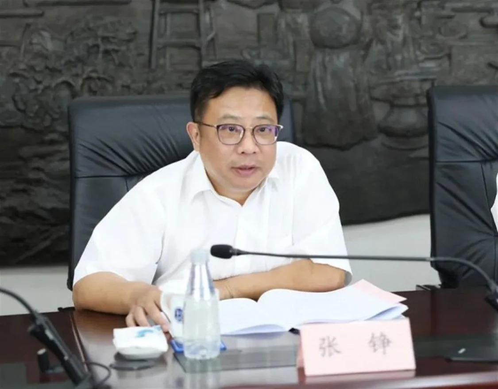
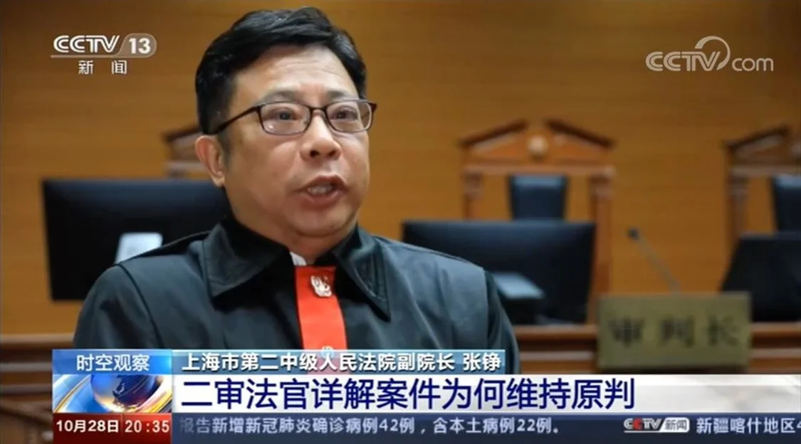

> 转：[曾主审“小红楼”案，上海松江法院原院长张铮获刑10年半\_凤凰网](https://news.ifeng.com/c/8PF136S067V)

---

### 曾主审“小红楼”案，上海松江法院原院长张铮获刑10年半

###### 上海一中法院

###### 2023年04月24日 09:51:31

据上海一中法院微信公众号消息，4月23日上午，上海市第一中级人民法院（以下简称上海一中院）一审公开宣判上海市松江区人民法院原党组书记、院长张铮受贿一案，对被告人张铮以受贿罪判处有期徒刑十年六个月，并处罚金人民币一百一十万元。

#### 9年受贿上千万，履新两个月后被查

上海一中院经审理查明：2012年至2021年间，被告人张铮利用其职务上的便利，以及职权或者地位形成的便利条件，多次收受请托人给予的财物，共计折合人民币1,110.96万余元。

上海一中院认为，被告人张铮身为国家工作人员，利用职务上的便利以及职权或者地位形成的便利条件，非法收受他人财物，为他人谋取利益，其行为已构成受贿罪，且数额特别巨大。综合考虑本案犯罪事实，张铮到案后的认罪态度、追缴赃款赃物等情节，法院依法作出上述判决。

公开履历显示，张铮，1969年10月生，今年54岁，上海市人，法学学士，1992年7月参加工作，1998年12月加入中国共产党。

张铮在法院系统工作了近30年，曾任上海二中院民一庭副庭长、民三庭庭长、立案庭庭长，后调任上海市高级人民法院，历任信访办公室主任、立案庭副庭长、立案庭庭长。

2019年1月，张铮再次返回老单位，出任上海市第二中级人民法院副院长，至2021年7月卸任。

2021年7月29日，张铮卸任上海市第二中级人民法院副院长，当年8月20日在上海市松江区五届人大十次会议上他被补选为松江区人民法院院长。

2021年10月19日下午， 松江区法院、松江区司法局联合召开探索实行调解程序前置暨非诉讼争议解决中心法院联络处基层联系点建设推进会，张铮出席会议。

那也是他最后一次对外亮相。12天之后，2021年11月1日，张铮被查。

2022年6月，张铮被“双开”。据上海市纪委监委通报，张铮身为党员领导干部，理想信念丧失，背弃初心使命，知纪违纪，执法犯法，以权谋私，严重破坏司法公信力，严重损害政法队伍形象。张铮违反政治纪律，不按照有关规定向组织报告重大事项；违反中央八项规定精神，违规出入私人会所和接受管理服务对象宴请；违反廉洁纪律，长期违规借用管理服务对象财物；违反工作纪律，违规干预和插手司法活动；违反生活纪律；利用职务便利为他人谋取利益，收受巨额贿赂。

#### 曾主审“小红楼”涉黑案

张铮曾主持审理全国扫黑办挂牌督办的涉黑案、留学生江歌母亲自诉网络诽谤等引起社会关注的大案。

2020年10月27日，一起侮辱、诽谤江歌及其母亲的案件在上海市第二中级人民法院二审宣判。二审裁定维持一审判决，被告人谭斌以侮辱罪、诽谤罪被判处有期徒刑一年六个月。

负责审理此案的时任上海二中院副院长张铮接受央视采访时表示，网络不是法外之地，网民在网络上也应知法、守法、用法、懂法，本案的判决对于网络暴力的规制起到了一定的标杆作用。

另外，张铮还主持审理了全国扫黑办挂牌督办的“小红楼”赵富强等38人涉黑案。

2020年8月17日至21日，上海二中院对检察机关指控赵富强等38名被告人犯组织、领导、参加黑社会性质组织、强奸、组织卖淫、诈骗、强迫交易、受贿、行贿等罪一案进行了开庭审理。

2020年9月22日，赵富强等38人涉黑案一审公开宣判，其中赵富强被判处死缓，且限制减刑。

官方披露，赵富强曾通过长期行贿、吃请、提供嫖宿等手段，拉拢、腐蚀其所在地国家工作人员及国有企业有关工作人员。

该案幕后有不少“保护伞”，包括上海杨浦区委原常委、政法委原书记卢焱（已获刑17年），杨浦区人民法院原院长任湧飞（获刑7年半）。

###### [责任编辑：张洪香 PX205]
