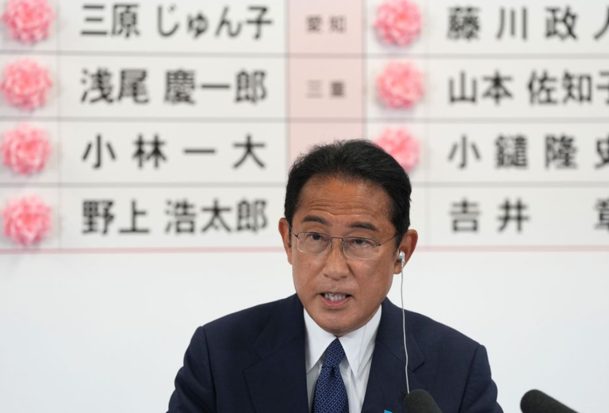

> 转：[环球时报社评：“修宪”是魔盒非宝箱，日本打开后患无穷](https://xinwen.bjd.com.cn/content/s62cca803e4b0647f1b157684.html)

---

## 环球时报社评：“修宪”是魔盒非宝箱，日本打开后患无穷

##### 环球时报

##### 2022-07-12 06:45

日本第26届参议院选举结果11日揭晓，岸田文雄领导的执政联盟“大获全胜”，主张“修改宪法”的力量获得超过2/3的席位，越过启动修宪进程所需的“门槛”。岸田文雄当天在记者会上表示，将尽快就自民党提出的在和平宪法中明确写入自卫队等四项修改议题，在国会发起讨论。许多分析认为，日本对和平宪法修改的障碍已经基本扫除，修宪的可能性“比任何时候都高”。

现行《日本国宪法》于1947年实施，其第九条明确规定，日本不允许拥有军队，并放弃“发动战争的权利”，因此得名“和平宪法”。这既是日本战后回归国际社会的前提，也是东亚持久和平的基石之一。尽管日本在2016年实施新安保法解禁“集体自卫权”、打破自1945年以来禁止向海外派兵的限制，已经在很大程度上架空了和平宪法，但是否彻底捅破这层窗户纸，依然是个极其重要的风向标。

正因如此，修宪动议不仅在日本仍面临激烈争议，也在亚太邻国以及国际社会引发大范围的担忧，其中不乏旗帜鲜明的反对声音。在这种情况下，若把自卫队写入和平宪法第九条，就是日本向邻国，以及亚洲发出否定战后历史、否定和平发展道路的危险信号。从这个意义上说，是否改动和平宪法第九条，绝非全然的“日本内政”。日本军国主义的受害者，有理由也有必要向日本修宪表达关切、提出质疑。

在历史问题上，日本至今没有对亚洲邻国进行深刻的道歉和反省，反而其国内右翼势力一直在寻求对军事力量的彻底解绑，这是日本与邻国相处始终缺乏信任、龃龉不断的一个重要原因。尽管和平宪法第九条一直被右翼势力视为早晚必须拔除的“眼中钉”，但在过去几十年，爱好和平的民意像五指山一样压制着他们的蠢蠢欲动。如今安倍遇刺事件很可能给了日本自民党一个博取同情分的契机，将原本进展缓慢的议程大大提前，给历史倒车再踩上一脚油门。

岸田文雄11日提到，现在日本正面临战后最严峻的难关。他说的是实情，经济不景气、物价高涨、新冠肺炎疫情没有得到控制等等，让日本老百姓的日子过得并不容易。但从修宪的箱子里，掏不出任何可以应对这些迫切难题的工具，反而会放出噬人的魔怪。和平宪法束缚的是军国主义的冲动，从来没有束缚日本和平发展的能量，反而是其强大保障。被日本右翼刻意放大的不安全感，完全是没必要的。

最近十几年，日本右翼政客不断利用危机，宣扬和平宪法已经过时，用“另辟蹊径”来让它沦为一纸空文。此前有强推新安保法上路，现在则是将北约引向亚太、利用俄乌冲突“碰瓷”台海问题等等。可以确定，如果日本花费巨大成本大幅度扩张军力，甚至将自卫队最终升级为军队、重获战争权利，其结果将是日本自己从本来安全的位置走到了险地甚至绝境，也会将整个东亚拖到新一轮危机之中。

在这件事上，美国的因素不得不提。今天的日本仍然最顾忌华盛顿的脸色，如果没有得到美国的许可，日本是没这个胆子真修宪的。而美国对此既有纵容想让日本充当地缘政治打手的一面，也有警惕日本右倾化担心其脱离控制的一面。美国这两面的缓急影响着日本修宪进程的节奏。现在它显然是急于将日本推向在亚洲对抗中国的前台，故而在修宪这一自民党最关心的议题上卖“人情”。但不得不说，珍珠港事件并不久远。

当前，东京对于修宪的渴望已经不再遮遮掩掩，它对在军事上“发挥作用”重新充满兴趣，甚至在美国绥靖下有点飘了。但日本国内外爱好和平的力量决不能坐视，而要尽最大努力阻止它打开修宪的魔盒。日本政府更应该认识到，军国主义的尽头是悬崖，历史已经证明过一次，它不需要被证明第二次。

#### 编辑：王琼
