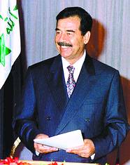

> 转：[重压之下仍然谈笑风生 萨达姆为何不惊慌？(图)](https://news.sohu.com/44/42/news206054244.shtml)

---

## 重压之下仍然谈笑风生 萨达姆为何不惊慌？(图)

###### NEWS.SOHU.COM 　　 2003 年 01 月 29 日 11:25 　　人民网-环球时报

#### 萨达姆面临最紧要关头

近几天，一些西方专家认为，美国总统布什与伊拉克总统萨达姆摊牌的时刻即将到来。1 月 24 日，英国《卫报》报道说，白宫官员透露，布什将在未来数周内发动对伊战争。俄罗斯参谋部一名高级官员也透露说，根据他们得到的情报，“美国已经决定开战。战斗将在 2 月中旬打响”。另据美国哥伦比亚广播公司 1 月 25 日报道，五角大楼已制定了一份周密的作战计划：在战争第一天向伊拉克发射 300—400 枚巡航导弹，然后以闪电战的形式占领巴格达。英国媒体则报道说，五角大楼另有一份作战计划———战斗打响后，美军将派特种部队迅速夺取伊境内的油田。

与此同时，美国高层的战争论调也让人感到形势紧迫。五角大楼官员声称，他们将不理会欧洲盟国的反对，“作好在 2 月中旬出动 15 万兵力攻打巴格达的准备”。此外，美国总统布什、国防部长拉姆斯菲尔德、国务卿鲍威尔、总统国家安全事务助理赖斯、副国防部长沃尔福威茨等人异口同声地表示：萨达姆的时间不多了。专家普遍认为，美国和伊拉克的争执已经到了“最后阶段”。1 月 27 日，联合国“监核会”和国际原子能机构将向安理会提交对伊武器核查报告；28 日，布什将发表国情咨文，就对伊政策发出重要“信号”；31 日，布什将与英国首相布莱尔举行会谈，会谈可能涉及对伊动武的“时间表”。

#### 萨达姆似乎并不在意

面对美国最强大的压力，萨达姆显得非常冷静。据伊拉克通讯社报道，日前，萨达姆在一次军事会议上对他的高级将领们说：“我头一放在枕头上就能睡着。我不需要安眠药。”最近，除了召开几次军事安全会议外，萨达姆并没有特别的举动。他像往常一样会见外宾、体恤民情。记者采访了刚刚从伊拉克回国休假的一名中国驻伊拉克使馆官员。他告诉记者，从美国向海湾调兵以来，他在巴格达就一直没有感受到战争气氛，现在也一样。巴格达市民像过去一样过着他们的小日子，市场上也没有出现抢购风。

同时，萨达姆在行动上也没有向美国服软。他多次在高级军事会议上表示：“胜利一定属于伊拉克！”他叮嘱手下，“在邪恶的敌人踏上我们的土地前，一定要保护好我们的士兵和弹药”，“我们将在地面战斗中击溃敌人”。1 月 23 日，萨达姆的长子乌代向美国发出警告：如果美国执意进攻伊拉克，他们将遭受比“9·11”事件更为惨痛的打击。外界一般认为，伊拉克军队绝非美军的对手，但萨达姆似乎并不这么看。他准备摆开架势，同美军大打一场。他先后更换了负责作战、训练和后勤的 3 名副总参谋长以及空军司令、海军司令，并在总结海湾战争失败教训的基础上调整了军事部署，将伊拉克全国重新划分为四大战区，构成对现政权的有效“防护网”。日前，伊政府特许美英记者前往北部重镇摩苏尔采访。在摩苏尔和伊拉克北部库尔德人自治区之间的一条公路上，人们能看到大批新建掩体；许多坦克和大口径野战炮正隆隆驶进阵地；一群孩子正在军队教官的指挥下进行操练。

#### 三个策略对付美国

美军炮弹已经装进炮膛，而萨达姆还在跟布什顶牛，他对付布什用的是什么策略？记者就此采访了几位伊拉克问题专家。专家认为，原因不外乎三个方面：

第一，萨达姆是在用他一贯的“硬汉形象”来应对布什的咄咄逼人。萨达姆的经历中充满“血与火”的考验。他少小颠沛，青年时期历尽磨难。但他始终胸怀大志，并在血腥的政治斗争中出人头地，终于登上伊总统宝座。之后他经历了 1980—1988 年两伊战争和 1991 年海湾战争的大风大浪。这些经历加上他的个性，使他不会轻易“向敌人下跪”。这些年，他一直巧妙地同美国历任总统玩“猫捉老鼠”的游戏，先后 7 次化解一触即发的战争危机。或许萨达姆相信，他一如既往的“硬汉形象”会增加敌人对动武的顾虑，以及因担心他“什么都干得出来”而向他作出妥协。

第二，作为伊拉克的统帅，萨达姆必须安定民心，不能让周围的亲信和伊拉克百姓看出他有丝毫动摇，以此来击破美国的计划———让伊拉克人在重压之下群起反对萨达姆。自当上总统起，萨达姆就集各种权力于一身。海湾战争后，他多次改组内阁，使各级政权始终牢牢掌握在他众多亲信和 100 多万组织严密、效忠于他的复兴社会党党员手中。萨达姆很清楚，大战临近，他在这个敏感时期的一举一动都将对周围的人产生巨大影响。他不能让这些人对他产生怀疑，要让他们一如既往地信任他，崇拜他，拥戴他。

至于伊拉克百姓，如果他们在此时产生对战争的恐惧感，伊拉克社会必将陷入混乱。这是萨达姆最不愿看到的。他的轻松姿态确实起到了作用。现在，巴格达的商店照常营业，剧院依旧在上演滑稽剧目。特别让人感到意外的是，巴格达和其他地区还在大规模地修路盖房子。几天前，萨达姆指示巴格达市政府：“将横跨底格里斯河的共和国大桥装扮一下。”于是，一大群工人拎着油漆桶来到这里，热火朝天地干了起来。与此同时，一座大型建筑正在一天天地“长”高———工人们正在修建一座漂亮的砂岩办公楼。这座办公楼建成后将成为复兴社会党的新总部。

第三，用好“拖”字诀，以拖待变。专家认为，这是萨达姆最重要的对美策略。

#### “以拖待变”能否奏效

关于萨达姆的“拖”字诀，专家认为，萨达姆的最大心愿是在时间和事态的发展上拖着美国走，使形势朝着有利于他的方向发展。萨达姆的以拖待变策略有三个用意：

首先，希望全球性的反战示威和大国的反对能使美国作出妥协。在这一方面，萨达姆的策略已初见成效。不久前，欧美国家爆发了大规模的反战示威，使美英政府受到沉重的压力。据沙特媒体报道，美国和英国的有关部门正在研究延长联合国对伊武器核查时间的可行性，美国国务卿鲍威尔和英国外交大臣斯特劳还专门就此进行了讨论。另外，鲍威尔还同国防部长拉姆斯菲尔德进行了秘密会谈，并在会谈后告诉国会外交委员会，政府准备同意将联合国对伊武器核查的时间延长几周或者一个月。有鉴于此，已有西方媒体改口说，“战争可能在 3 月份爆发”。而大国反对美国对伊动武也是萨达姆最想看到的。目前，除英国、澳大利亚等国外，绝大多数国家均反对美国攻伊。1 月 24 日，德国总理施罗德同俄罗斯总统普京特意通了电话，他们呼吁，应该延长联合国武器核查人员在伊工作的时间。很显然，萨达姆看到了大国在伊拉克问题上有利益冲突，他希望能从中“得到好处”。

其次，想通过“拖”的方式，使伊拉克问题演变成美英等国的国内问题。在这一点上，萨达姆的意图也初步奏效。不久前，美英两国的民意调查显示，不少人认为对伊动武“是必须做的”，但现在，布什和布莱尔的支持率正在大幅下跌。1 月 23 日，英国首相布莱尔到一所学校演讲时不得不自后门而入，前门被大约 200 名反战示威者占据了。而在演讲过程中，又有学生严词批评他讲话“不得要领”，搞得布莱尔十分狼狈。布什也有同样的遭遇。24 日，100 多名美国法学教授联名向他发出警告，声称他如果发动对伊战争，“将很有可能面临战争罪指控”。国内问题关乎布什和布莱尔的政治生命，如果反对声音进一步增强，他们将不得不三思而后行。特别是布莱尔，许多英国人痛恨他成了布什的“跟屁虫”，目前更因为在伊拉克问题上天天附和布什而遭受了前所未有的抨击，所以，形势对他更为严峻。有人甚至说，布莱尔因承受不了国内压力而与布什分道扬镳的可能性并非不存在。假如这种可能变为现实，萨达姆应该是最高兴的。

再次，萨达姆寄希望于周围的阿拉伯国家能拿出一个有利于他的方案。1 月 23 日，土耳其、叙利亚、沙特、约旦、伊朗和埃及等 6 个国家召开外长会议，专门讨论伊拉克问题。虽然会议没有达成实质性的解决方案，但专家们认为，这 6 个“此前并不和睦”的国家此时坐在一起，本身就是一件很重要的事情，所以，六国会议不会草草收场，“秘密会谈应该正在进行”，其主要内容可能就是为萨达姆找出路。

接受记者采访的专家一致认为，萨达姆还会接着往下拖，这将使局面更加复杂，但这正是萨达姆所希望的。局势越乱，他越能得到想要的东西。但他的这个策略也很危险，因为布什说过：“我已经很不耐烦了。”专家特别提到一点：萨达姆采取以拖待变的策略，说明他认为自己还没有被逼到“最后的墙角”，他还有回旋余地。但不知美国会怎么对待他的这个策略。(本报特约记者 高祖贵)
