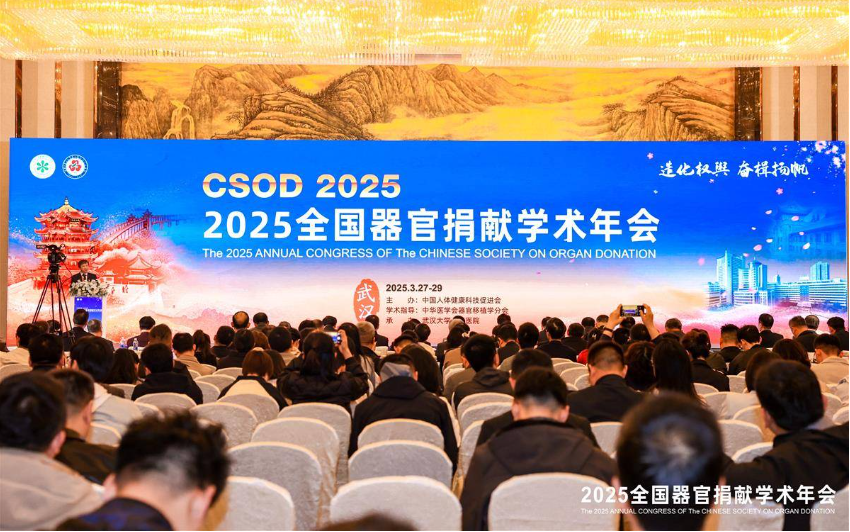
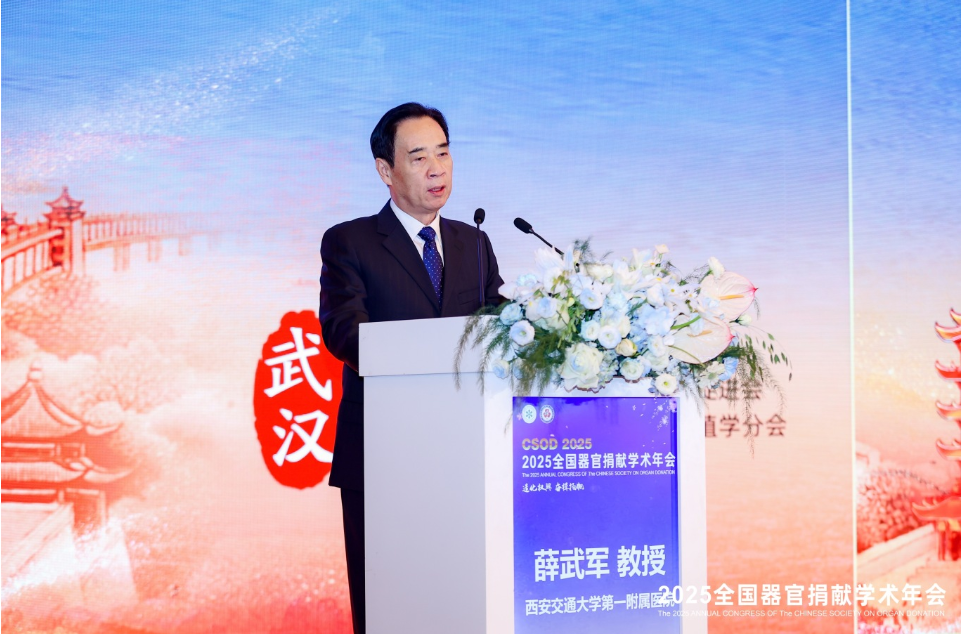
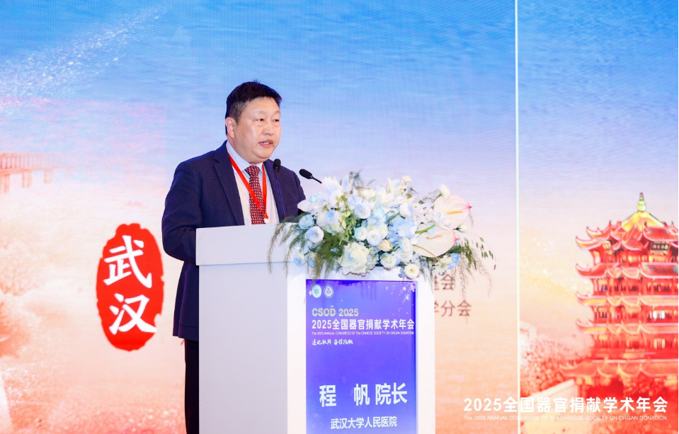

> 转：[首届全国器官捐献学术年会在武汉召开-新华网](http://hb.news.cn/20250331/bcfe95b0e1b344a4bf430f9b40683b1a/c.html)

---

# 首届全国器官捐献学术年会在武汉召开

首届全国器官捐献学术年会日前在武汉召开，500 多位全国专家学者齐聚大会，共同探讨技术创新与临床实践，深入研究学科融合与未来发展，紧密围绕器官捐献领域的最新进展、技术创新、临床挑战、法律伦理以及未来发展方向与策略进行深入探讨。

中华医学会器官移植学分会主任委员、健科会副会长薛武军说，2024 年《人体器官捐献和移植条例》的实施，标志着我国器官捐献和移植事业经过探索和实践，以及改革创新，已步入规范化、法制化、国际化的轨道。当前器官移植面对新的历史发展机遇，学科需要不断调整和优化发展，也需要社会各界广泛关注和帮助。“下一步要推进器官捐献宣传力度，促进全民对于器官捐献的认知，以助力构建更加完善的器官捐献体系建设，推动器官移植事业高质量发展。”

中国器官移植发展基金会理事长赵洪涛表示，没有器官捐献，就没有器官移植。医疗机构及相关单位应加大人体器官捐献科普的宣传力度，积极营造全社会捐献光荣的良好氛围。没有移植专家持之以恒的努力，就没有整个器官移植事业的发展，创新发展、行稳致远是全国器官移植同仁共同的发展目标。以本次年会为契机，全国专家同行汇聚武汉，将进一步推动我国器官移植和捐献工作前进，走创新发展之路，不断科学规范，为医学事业进步不断贡献健康动力。

湖北省卫健委医疗应急处副处长严峰表示，器官捐献和移植是人类医学史上的伟大跨越，传递生命希望，彰显人间大爱，充分体现了团结奉献、互助友爱的精神。经过共同努力，湖北省不断科学规范管理，器官移植事业健康快速发展。第一届全国器官捐献学术年会在武汉召开，将激励和促进湖北乃至全国器官捐献事业的发展，为助力健康湖北、健康中国的建设贡献力量。

本次大会由中国人体健康科技促进会主办，中华医学会器官移植学分会指导，武汉大学人民医院（湖北省人民医院）承办。据悉，早在 1983 年，武汉大学人民医院詹炳炎教授带领实施了亚洲首例同种异体睾丸移植术，1985 年又实施了世界首例胎儿肾上腺移植术。近年来，在周江桥教授带领下，武汉大学人民医院器官移植学科实力位居全国第一方阵，器官移植数量位居全国名列，医院还开展了包括心肺联合移植，肝肾联合移植，心脏+主动脉弓移植等多种高难度的器官移植技术。（宁亚飞）

【责任编辑:连迅】
